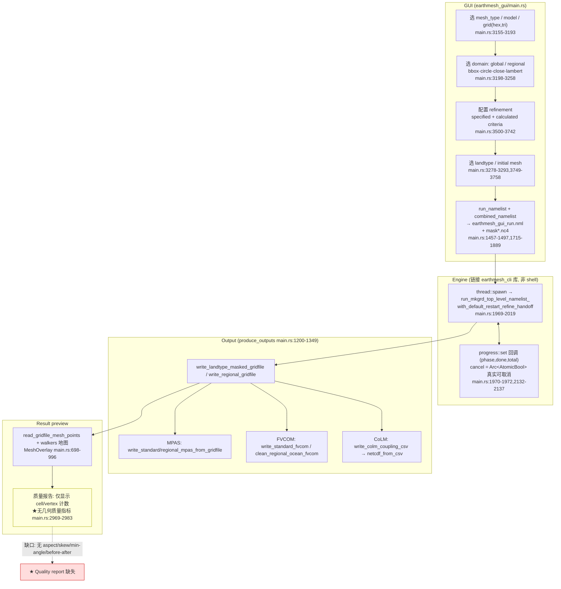
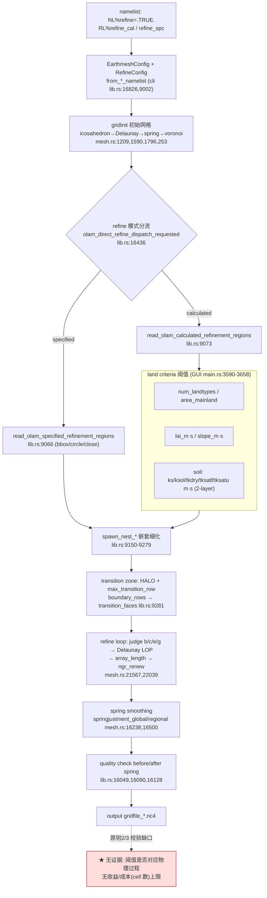
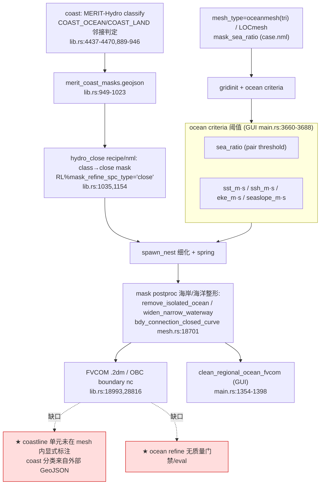
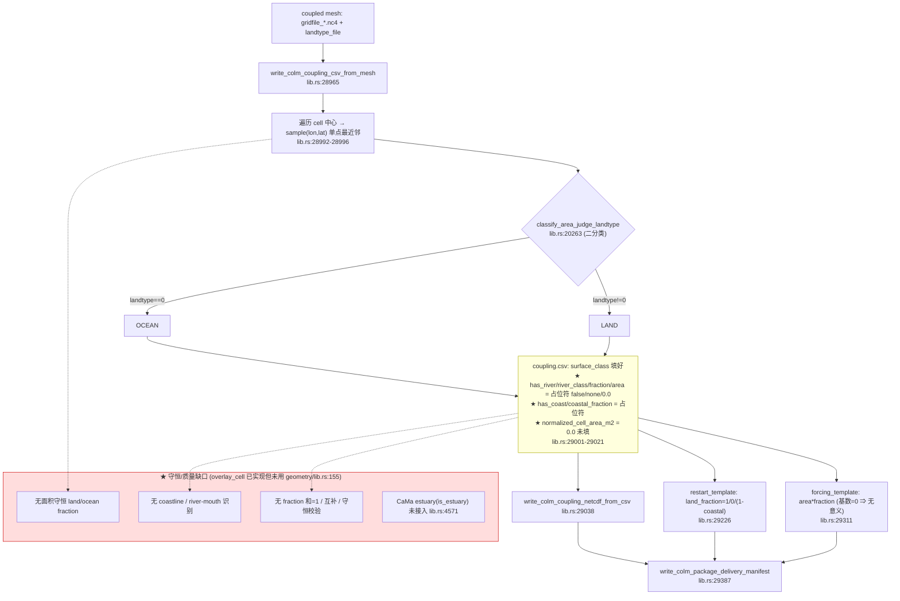
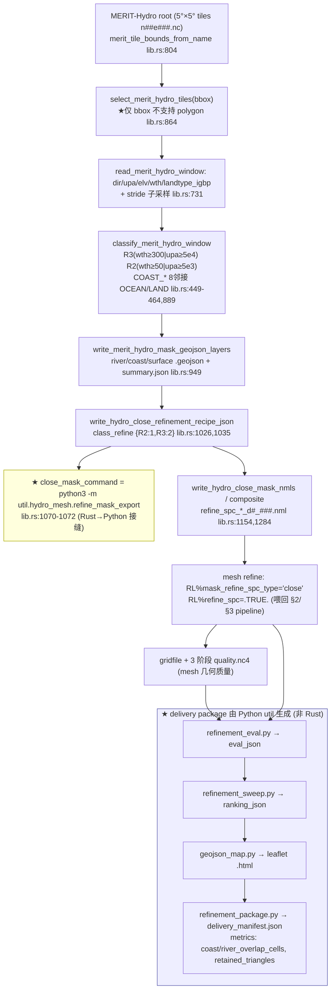

# 02 — Workflow Consistency Audit (EarthMesh v3)

> Phase P1/P3 衔接 · 只读阶段（未修改任何 `src/rust` 代码）
> 基准：[AUDIT_PRINCIPLES.md](./AUDIT_PRINCIPLES.md) · 计划：[PROJECT_AUDIT_PLAN.md](./PROJECT_AUDIT_PLAN.md) · 上游：[01_build_and_crate_audit.md](./01_build_and_crate_audit.md)
> 审查对象：EarthMesh v3，分支 `v3.0.0-alpha1`，仅当前项目，不引用任何旧版本。
> 证据：函数名/行号取自 `rust/earthmesh_gui/src/main.rs`、`rust/earthmesh_cli/src/lib.rs`、`rust/earthmesh_cli/src/main.rs`、`rust/earthmesh_mesh/src/lib.rs`、`util/` 与 `examples/merit_hydro/*/delivery_manifest.json`。
> 日期：2026-06-22 · 证据等级见 AUDIT_PRINCIPLES §5。

---

## 0. 最重要发现（先读）

1. **v3 实为 Rust + Python 混合，而非纯 Rust-native**（A）。hydro-coast 的**评估 / ranking / HTML 地图 / QA 门禁 / CaMa 河口 / 守恒交集 / CoLM 耦合**主要住在 Python `util/`（40+ `.py`：`util/v3_core/*`、`util/hydro_mesh/*`）。Rust 的 hydro-close recipe **生成一条调用 Python 的命令** `python3 -m util.hydro_mesh.refine_mask_export`（`cli/src/lib.rs:1070-1072`），且 `colm_coupling` 在 Rust（`lib.rs:28965+`）与 Python（`util/hydro_mesh/colm_coupling.py`）**重复实现**。
2. **land-ocean coupling 当前是占位骨架**（A）：cell 用**单点最近邻采样**做 land/ocean 二分类（`lib.rs:28992-29009`），CSV 的 river/coast/fraction/area 列全是占位符（`false/none/0.0`，`lib.rs:29001-29021`）；**无守恒面积分数、无 coastline/river-mouth 识别、无耦合质量校验**。`earthmesh_geometry` 已实现 `overlay_cell()`/`intersection_area()`（`geometry/src/lib.rs:114-210`）但 **coupling 完全没调用**。
3. **质量报告分裂**（A）：mesh 生成有 3 阶段 quality NetCDF（`gridfile_quality.nc4`/`quality_before_spring.nc4`/`quality_after_spring.nc4`，`lib.rs:16049/16090/16128`），但**无 HTML、无几何质量阈值门禁**；GUI **完全不展示任何质量指标**；hydro-coast 的 eval/ranking/HTML 只在 Python `util/` + delivery package 里。
4. **GUI 仅暴露 mesh 生成主干**（A），MERIT-Hydro / hydro-close / composite / CaMa / coupling-package 等 workflow **不可在 GUI 触发**，必须走 CLI + Python。

---

## 1. Mermaid Flowchart — GUI → Config → Engine → Output → Quality Report

---

## 2. Mermaid Flowchart — Land Feature Refinement

---

## 3. Mermaid Flowchart — Ocean / Coast Refinement

---

## 4. Mermaid Flowchart — Land + Ocean Coupled Mesh

> 注：真正的守恒 fraction / coast / river-mouth / QA 逻辑当前在 Python `util/hydro_mesh/earthmesh_intersection.py`、`colm_coupling.py`、`qa_gates.py`、`coastal_band.py`、`cama_*.py`，**不在 Rust crate 内**。

---

## 5. Mermaid Flowchart — MERIT-Hydro → Hydro/Coast Masks → Refinement → Quality Report

> 证据：`examples/merit_hydro/gba/delivery_manifest.json` 含 `eval_json`/`ranking_json`/`html_map`/`metrics{coast_overlap_cells,river_overlap_cells,retained_triangles}`，`kind=earthmesh_hydro_coast_delivery_package`——这些产物由 Python `util/hydro_mesh/*` 生成，Rust 内无对应函数（grep 确认）。

---

## 6. Workflow Consistency Table

| Workflow | Input | Intermediate files | Output | Current risk | Missing validation | Recommended redesign |
|----------|-------|--------------------|--------|--------------|--------------------|----------------------|
| **GUI run** | UI 状态 (mesh_type/grid/domain/refine) | `earthmesh_gui_run.nml`, `mask_*.nc4`(临时) | gridfile + MPAS/FVCOM/CoLM | 配置散落 UI，无 dry-run 校验；无质量反馈 | 无 namelist 合法性/资源存在性预检；无质量门禁 | 引入"config 校验+预览+质量卡片"步骤；project template 化 |
| **Gridinit (普通 mesh)** | namelist (NXP/niter/beta/relax) | gridfile_NXP*_01_*.nc4 | gridfile_*.nc4 + quality.nc4 | olam 半径单测红(见 01#1) | 无几何质量阈值门禁（仅写 nc 不判定） | 质量指标→阈值门禁，失败可阻断 |
| **Specified-region refine** | refine_spc + bbox/circle/close mask | mask nc4 / nml | 细化 gridfile | 区域重叠/越界无校验 | 无 region 合法性、无 refine ratio 平滑检查 | 区域校验 + transition 平滑度报告 |
| **Threshold/calculated refine** | refine_cal + threshold_dir/landtype | 阈值场 | 细化 gridfile | 阈值物理依据不明(原则2)、无成本上限(原则3) | 无"异质性→物理过程"映射、无 cell 预算 | 阈值→物理过程登记表 + cell 预算约束 |
| **MERIT-Hydro mask gen** | MERIT root + bbox + thresholds | window, *.geojson, summary.json | river/coast/surface geojson | **仅 bbox 不支持 polygon**；ocean landtype 硬编码(0/17) | tile 覆盖完整性、分类阈值未对照物理 | 支持 polygon/shapefile；阈值参数外置 |
| **Hydro-close recipe** | river/coast geojson + class_refine | recipe.json | recipe + namelist overrides | **recipe 内嵌 python3 调用**(Rust→Python) | 无 recipe schema 校验 | 把 refine_mask_export 真正 Rust 化，去 Python 依赖 |
| **Hydro-close mask NML** | geojson + options | — | `refine_spc_*_d#_###.nml` | cumulative_refine 可致 nml 数量爆炸 | 无 nml 数量/分离度健全性检查 | 数量上限告警 + 干运行统计 |
| **Hydro-composite close mask** | recipe(components[]) | — | 合成 nml + summary.json | 合成优先级=数组顺序(隐式)；去重靠 (feature,ring) | 无组件冲突/覆盖报告 | 显式优先级 + 冲突可视化 |
| **Land-ocean coupling** | gridfile + landtype | coupling.csv (占位列) | coupling/restart/forcing nc4 + manifest | **点采样非守恒；river/coast/area 全占位** | **无守恒 fraction、无和=1、无 coast/river-mouth** | 接 overlay_cell 做守恒 fraction + QA 校验 |
| **CoLM/MPAS/FVCOM/OLAM/native output** | gridfile | — | nc4/2dm/graph.info/csv | FVCOM regional 开边界静默跳过(main.rs:1303) | 输出后无结构校验/读回验证 | 输出 round-trip 读回校验 |
| **GeoJSON/NetCDF/CSV/HTML report** | 各 workflow 产物 | — | geojson/nc/csv；**HTML 仅 Python** | HTML/eval/ranking 依赖 Python util | Rust 侧无 HTML/eval/ranking | 决策：Rust 化报告 or 正式承认 Python 层 |

---

## 7. Top 20 Workflow Risks

| # | 风险 | 严重度 | 类别 | 证据 |
|---|------|--------|------|------|
| 1 | coupling 用点采样非守恒，land/ocean 分类网格方向敏感、漏小岛/碎岸 | Blocker | Physical | `lib.rs:28992-29009` |
| 2 | coupling CSV 的 river/coast/fraction/area 全为占位符，下游误读为"无河流/无海岸" | Blocker | Data | `lib.rs:29001-29021` |
| 3 | 无守恒 fraction：`overlay_cell`/`intersection_area` 已实现却未接入 coupling | High | Physical | `geometry/lib.rs:114-210` 未被调用 |
| 4 | hydro-coast eval/ranking/HTML/QA 在 Python util，与"Rust-native"定位冲突，可复现性割裂 | High | Arch | `util/hydro_mesh/*`, `lib.rs:1070-1072` |
| 5 | `colm_coupling` Rust 与 Python 双实现，易行为漂移 | High | Arch | `lib.rs:28965` vs `util/hydro_mesh/colm_coupling.py` |
| 6 | recipe 生成内嵌 `python3 -m util...` 命令，部署需 Python 环境 | High | Build/Deploy | `lib.rs:1070-1072` |
| 7 | 无 coastline / river-mouth 显式识别（CaMa `is_estuary` 未接入） | High | Physical | `lib.rs:4571`, doc `28960-28966` |
| 8 | calculated refine 阈值无"物理过程相关性"依据（违原则2） | High | Physical | `case.nml` RL%refine_* + GUI criteria |
| 9 | refine 无 cell 预算/成本上限（违原则3，可无限细化） | High | Physical | 无相关参数 |
| 10 | 无几何质量门禁：quality 只写 NetCDF 不判定/不阻断 | High | Quality | `lib.rs:16049-16128` |
| 11 | GUI 不展示任何质量指标，用户盲跑（违原则5） | High | GUI | `main.rs:2969-2983` |
| 12 | MERIT tile 选择仅 bbox 不支持 polygon，复杂流域需手工 | Med | Workflow | `lib.rs:864-886` |
| 13 | ocean/coast landtype 硬编码 IGBP 0/17，数据集变更即失效 | Med | Robustness | `lib.rs:449-464,4437` |
| 14 | composite 合成优先级=组件数组顺序（隐式），无冲突报告 | Med | Workflow | `lib.rs:1403-1490` |
| 15 | cumulative_refine 默认生成 1..N 全层 mask，nml 数量可爆炸 | Med | Scale | `lib.rs:1543`, options |
| 16 | FVCOM regional 开边界静默跳过，用户拿不到 .2dm 无告警 | Med | UX/Data | `main.rs:1303-1305` |
| 17 | olam_delaunay 半径单测红（数值稳定性），细化前几何基线不稳 | Med | Numerical | 见 [01](./01_build_and_crate_audit.md)#1 |
| 18 | CLI 派发靠 namelist 内容隐式推断模式，难以预测走哪条分支 | Med | Workflow | `lib.rs:16436-16514` |
| 19 | 无输出 round-trip 校验（写出的 MPAS/FVCOM/nc 未读回验证） | Med | Quality | output 段无校验 |
| 20 | GUI 无法触发 hydro/MERIT/composite/coupling-package，能力割裂 | Med | GUI | GUI 仅 §1 主干 |

---

## 8. 哪些 Workflow 适合在 GUI 暴露

| Workflow | 现状 | 建议 | 理由 |
|----------|------|------|------|
| Gridinit / specified refine / 基础 output | 已暴露 | 保持 + 加质量卡片 | 高频、参数有界、可视化收益大 |
| Calculated refine 阈值 | 已暴露(参数) | 增加"阈值→物理过程→预期收益"解释面板 | 满足原则5 |
| MERIT-Hydro mask 生成 | 未暴露 | **应暴露**：选 MERIT root + bbox/polygon + 阈值 → 预览 river/coast 图层 | 空间交互天然适合 GUI |
| Hydro-close recipe / mask / composite | 未暴露 | **应暴露**（向导式）+ 预览 close mask 叠加 | 参数多、易错，需可视化 |
| Land-ocean coupling 预览 | 部分(CoLM 输出) | 暴露 land/ocean/coast fraction 热力图 + QA 卡片 | 守恒/分类需可视核验 |
| 输出 round-trip 校验报告 | 无 | 暴露"输出健康检查"面板 | 即时反馈 |
| Native OLAM 嵌套网格 | 仅文本粘贴(main.rs:3814) | 暂不深做 GUI 构建器（低频、专家用） | 成本高、用户少 |

---

## 9. 哪些 Workflow 应先改造成 Project Template

> "project template" = 一份可复制、自带默认 + schema + 校验的算例骨架（参考现有 `examples/merit_hydro/*/case.nml` + `*_or_manifest.json`）。

| 优先级 | Workflow | 模板化内容 | 理由 |
|--------|----------|-----------|------|
| P0 | **MERIT-Hydro 区域 hydro-close 算例** | case.nml + thresholds + recipe + delivery manifest schema | 已有雏形(gba/yangtze)，最复杂、最需复用 |
| P0 | **Land-ocean coupled (CoLM) 算例** | coupling 配置 + landtype + QA 期望值 | 占位实现需模板锁定契约 |
| P1 | **全球 atmosphere/land/ocean hex 基础算例** | 已有 `examples/default/*.nml`，补 schema/校验 | 入门模板 |
| P1 | **specified-region refine 算例** | bbox/circle/close 区域模板 + 质量期望 | 常用、参数有界 |
| P2 | **composite close mask 多源算例** | components[] 模板 + 优先级说明 | 高级用法，需规范 |

建议模板统一带：`schema_version`、输入清单、默认阈值、**期望质量指标/QA 门禁**、可选 `delivery_manifest`。

---

## 10. 哪些 Workflow 缺少质量报告

| Workflow | 质量报告现状 | 缺口 |
|----------|--------------|------|
| Mesh 生成(几何) | ✅ 3 阶段 quality NetCDF（before/after spring） | ★ 无阈值门禁、无 HTML、无 GUI 展示、指标含义未文档化 |
| GUI run | ❌ 仅 cell/vertex 计数 | ★ 无任何几何/拓扑质量指标（违原则5） |
| Specified/calculated refine | ❌ 无细化专属报告 | ★ 无 transition 平滑度、refine ratio、收益/成本报告 |
| MERIT-Hydro mask | ⚠ 仅 `summary.json`(计数) | ★ 无分类质量/覆盖率评估 |
| Hydro-close / composite | ⚠ Python `refinement_eval.py`/`refinement_sweep.py` | ★ **Rust 侧完全无** eval/ranking |
| Land-ocean coupling | ❌ 无 | ★ **无守恒校验、无 fraction 和=1、无陆海互补检查** |
| 模式输出(MPAS/FVCOM/CoLM/OLAM) | ❌ 无 | ★ 无输出结构/round-trip 校验报告 |
| HTML 可视报告 | ⚠ 仅 Python leaflet(`geojson_map.py`) | ★ Rust 侧无 HTML 报告能力 |

**总结**：除 mesh 几何质量有 NetCDF 输出外，**refine 收益评估、coupling 守恒校验、输出健康检查、统一 HTML 报告**四类质量报告在 Rust 侧均缺失；hydro-coast 的 eval/ranking/HTML 依赖 Python `util/`。

---

## 关键证据索引（file:line）

- GUI 编排：`gui/main.rs:1457-1497`(config), `1896-2019`(start_run), `2040-2139`(poll/cancel), `1200-1349`(produce_outputs), `698-996`(地图), `2969-2983`(仅计数无质量)
- CLI 派发：`cli/main.rs:158-234`; 调度 `cli/lib.rs:16436-16514`
- mesh pipeline：`mesh.rs:1209/1590/1796/253`(gridinit), `21567/22039`(refine LOP/length), `16238/16500`(spring), `18168/18701`(postproc); quality `cli/lib.rs:16049/16090/16128`
- hydro：`cli/lib.rs:731/804/864/889/949/1026/1035/1070-1072/1154/1284`
- coupling：`cli/lib.rs:28965/28992-29021/29038/29226/29311/29387`; geometry `geometry/lib.rs:114-210`; CaMa `cli/lib.rs:4571`
- Python 接缝：`util/v3_core/*`, `util/hydro_mesh/*`; delivery `examples/merit_hydro/gba/delivery_manifest.json`

*本报告所有结论基于实际源码与示例 manifest；未修改任何 `src/rust` 代码。Mermaid 图中红色=缺口、黄色=占位/弱、蓝色=Python 外部依赖。*
