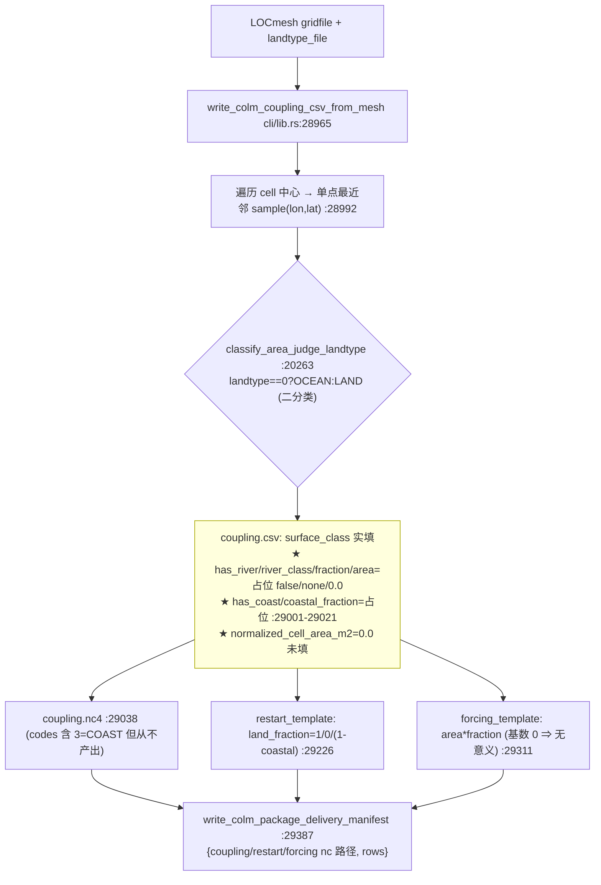
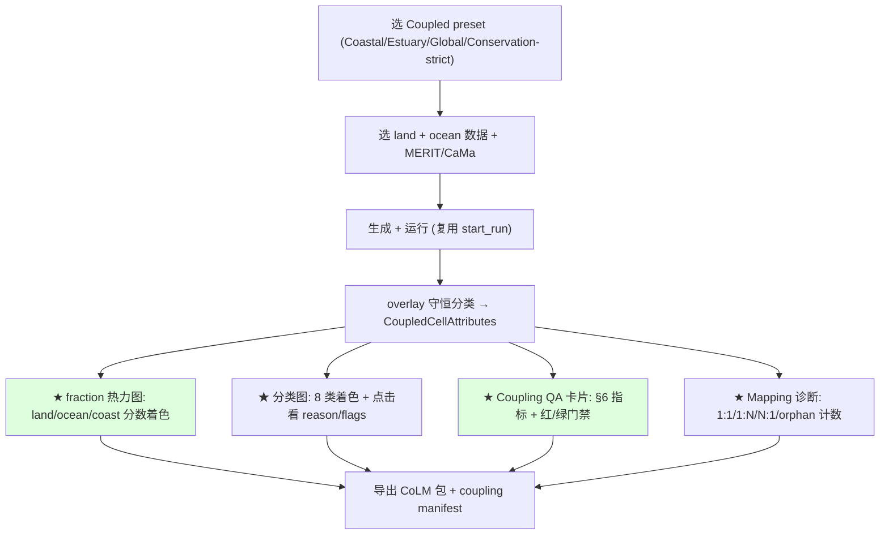

# 05 — Land-Ocean Coupled Mesh (LOCmesh) Audit (EarthMesh v3)

> Phase P3/P4 衔接（提案，可提 patch，不落地）· 未修改任何 `src/rust` 代码
> 基准：[AUDIT_PRINCIPLES.md](./AUDIT_PRINCIPLES.md) · 上游：[02_workflow_consistency_audit.md](./02_workflow_consistency_audit.md)（coupling 深挖）· [03_config_schema_audit.md](./03_config_schema_audit.md)（`CoupledMeshConfig`）· [04_physical_refinement_audit.md](./04_physical_refinement_audit.md)（score 框架）
> 审查对象：EarthMesh v3，分支 `v3.0.0-alpha1`，仅当前项目，不引用任何旧版本。
> 证据：`core/lib.rs:1082,1099,1800`(LOCmesh 约束)、`cli/lib.rs:9374-9378`(LOCmesh refine)、`cli/lib.rs:21713,22831,23030`(GetRef_LOC containment split)、`cli/lib.rs:28965-29531`(colm coupling)、`geometry/lib.rs:114-210`(overlay 未用)。
> 日期：2026-06-22 · 证据等级见 AUDIT_PRINCIPLES §5。

---

## 0. 核心结论（先读）

**v3 当前不是"真正的陆海耦合网格"，而是"单一网格 + 逐格 land/ocean 二分类 + 占位耦合表"。**（A 级）

判定依据（grep 全量确认，0 命中=确实不存在）：

| 概念 | 代码命中 | 结论 |
|------|----------|------|
| `coastline` | **0** | 无海岸线一致性概念 |
| `river_mouth` | **0** | 无河口单元 |
| `outlet` | **0** | 无河流出口→海洋匹配 |
| `orphan` | **0** | 无孤立单元检测 |
| `sea_fraction` | **0** | 无海洋面积分数 |
| `mass_conserv` | **0** | 无质量守恒 |
| `conservativ`(remap 义) | **0** | 无守恒 remapping（`conservativ` 仅指 CaMa 阈值） |
| `land_fraction` | 6（仅模板） | = 1/0/(1-coastal)，coastal 恒占位 0 → **实质二值** |
| `estuary` | 8（CaMa 数据） | 数据存在但 **未接入 coupling**（[02](./02_workflow_consistency_audit.md)§3） |

> 与 [02](./02_workflow_consistency_audit.md) 的 W1/W2/W5 一致：分类是**单点采样**（`cli/lib.rs:28992-29009`），CSV 的 river/coast/fraction/area 全为占位符（`:29001-29021`），`geometry::overlay_cell`/`intersection_area` 已实现却**未被 coupling 调用**（`geometry/lib.rs:114-210`）。

---

## 1. Current Coupled Workflow

### 1.1 LOCmesh 是什么（实测）
- LOCmesh 是一个 `mesh_type`，**强制 CoLM 输出**（`core/lib.rs:1082` `("LOCmesh","CoLM")=>Ok`；其它格式报错 `:1099`）。
- 需真实 `landtype_file`（`cli/lib.rs:9378`）。
- 需至少一个 land/ocean/atmos 阈值开关为真（`core/lib.rs:1800`）。
- 细化判据通过 **`GetRef_LOC` containment 拆分**：把单元二分配给 land / ocean（/atmos）阈值集（`cli/lib.rs:21713` "Split the mixed land-ocean containment table"、`:22831`、`:23030`）。

> 即：LOCmesh = **一张网格**，按 landtype 把每个 cell 归到 land 或 ocean，再各自套用 land/ocean 细化阈值，最后导出 CoLM 耦合表。**不存在"一个 cell 同时含 land+ocean 分数"的概念。**

### 1.2 Coupling 导出链（来自 [02](./02_workflow_consistency_audit.md)§4，证据复述）



### 1.3 16 项能力核查（用户清单）

| # | 能力 | 现状 | 证据 |
|---|------|------|------|
| 1 | pure land cell | ✅ | `classify_area_judge_landtype` LAND `cli/lib.rs:20263` |
| 2 | pure ocean cell | ✅ | 同上 OCEAN（landtype==0） |
| 3 | mixed coastline cell | ❌ | 无 coastline；CSV 二分；COAST code 定义但从不产出 `:29062` |
| 4 | estuary cell | 🟡 | CaMa `is_estuary` 存在 `cli/lib.rs:4571`，**未接入** |
| 5 | river-mouth cell | ❌ | `river_mouth` 0 命中 |
| 6 | wetland/delta cell | ❌ | 无 |
| 7 | island cell | ❌ | 无岛屿识别 |
| 8 | fractional land/ocean area | ❌ | `land_fraction` 实质二值；`sea_fraction` 0 命中；`normalized_cell_area_m2=0` |
| 9 | conservative land-ocean remapping | ❌ | `overlay_cell` 未用；`conservativ` 仅 CaMa |
| 10 | coupling CSV/NetCDF | ✅(占位) | `cli/lib.rs:28965,29038`（列多为占位） |
| 11 | orphan cell detection | ❌ | `orphan` 0 命中 |
| 12 | river outlet→ocean matching | ❌ | `outlet` 0 命中 |
| 13 | coastline consistency | ❌ | `coastline` 0 命中 |
| 14 | mass conservation | ❌ | `mass_conserv` 0 命中 |
| 15 | coupling row count & coverage | 🟡 | `ColmCouplingNetcdfWriteReport.rows` 有计数；coverage 无校验 |
| 16 | 1:1 / 1:N / N:1 mapping diagnostics | ❌ | 无跨网格映射概念（逐格独立） |

> 命中：✅ 2 项、🟡 3 项、❌ 11 项。**真正的耦合语义（fraction/守恒/coast/outlet/orphan/mapping）几乎全缺。**

---

## 2. Missing Coupling Concepts

1. **Fractional cell（最根本）**：cell 应可同时持有 `land_fraction + ocean_fraction (+ river/coastal/wetland fraction)`，且 Σ=1。当前只有二值 surface_class。
2. **Conservative remapping**：land↔ocean 通量需面积守恒的重映射（用 `overlay_cell` 做多边形相交面积加权），当前完全缺失。
3. **Coastline 一致性**：land mesh 岸线与 ocean mesh 岸线必须是同一条线（无缝无重叠）；当前无 coastline 对象。
4. **River outlet → ocean matching**：CaMa 河流出口须匹配到相邻 ocean cell（径流入海），当前无 outlet 概念。
5. **Orphan 检测**：孤立 land cell（被海洋包围的单格）/孤立 ocean cell（内陆湖误判）需检测与处理；当前无。
6. **Mass conservation 校验**：耦合表的面积/通量须守恒（Σ land_area + Σ ocean_area = 总面积，跨网格映射权重 Σ=1）；当前无。
7. **Estuary / river-mouth / wetland-delta 单元类型**：物理上关键的过渡带，当前 CaMa 数据未接入。
8. **Mapping diagnostics**：1:1 / 1:N / N:1（land cell 对 ocean cell 的对应关系）诊断；当前耦合是逐格独立，无映射。
9. **Coverage 校验**：每个 cell 是否都被分类、是否有未覆盖区域；当前只数 rows，不查覆盖。
10. **Island complexity**：小岛/群岛在粗网格上易丢失，需保真；当前无。

---

## 3. Coupled Cell Classification Design

引入显式分类（替代二值 surface_class），每类带分数（对接 [03 `CoupledMeshConfig`](./03_config_schema_audit.md#3-rust-type-sketches)）：

```rust
pub enum CoupledCellClass {
    PureLand,            // land_fraction ≈ 1
    PureOcean,           // ocean_fraction ≈ 1
    MixedCoast,          // 0<land_fraction<1，含岸线
    Estuary,             // 海岸 + 河流出口（CaMa is_estuary）
    RiverMouth,          // 河流入海格（陆侧）
    WetlandDelta,        // 湿地/三角洲（低地+水网）
    Island,             // 被海洋包围的小陆块
    Orphan,              // 孤立/不一致单元（需修复）
}
pub struct CoupledCellAttributes {
    pub class: CoupledCellClass,
    pub land_fraction: f64,      // 守恒：Σ = 1
    pub ocean_fraction: f64,
    pub river_fraction: f64,
    pub coastal_fraction: f64,
    pub wetland_fraction: f64,
    pub cell_area_m2: f64,       // ★ 必填，当前为 0
    pub outlet_ocean_cell: Option<u64>,  // river outlet→ocean cell id
    pub quality_flags: Vec<CoupledQualityFlag>,  // Orphan/FractionSumError/...
}
```

**分类算法（守恒，替代单点采样）**：
1. 用 `geometry::overlay_cell(cell_polygon, masks)` 对每个 cell 求 land/ocean/river/coast 掩膜的**面积分数**（守恒，[02](./02_workflow_consistency_audit.md) W2 的现成函数）。
2. `land_fraction = Σ land 子多边形面积 / cell 面积`；同理 ocean/river/coastal；强制归一 Σ=1。
3. 阈值分类：`land>0.98→PureLand`；`ocean>0.98→PureOcean`；否则 `MixedCoast`；叠加 CaMa `is_estuary`→`Estuary`/`RiverMouth`；小连通域→`Island`；不一致→`Orphan`。
4. river outlet：对每个 RiverMouth，搜索相邻 ocean cell，记 `outlet_ocean_cell`（缺失则标 `OutletUnmatched`）。

---

## 4. Coupled Refinement Score

按用户给定骨架，补全归一化与数据（遵循 [04 §3.0 通用规则](./04_physical_refinement_audit.md#30-通用归一化与合成规则)；每 term = 一个 plugin `RefinementCriterion`）：

```
score_coupled =
   w1  · coastline_complexity                 // 单元内岸线曲率/分形 ∈[0,1]
 + w2  · unresolved_land_ocean_fraction_error // |round(frac)-frac| 大⇒需细化解析混合带
 + w3  · river_mouth_priority                 // CaMa river-mouth→1
 + w4  · estuary_priority                     // CaMa is_estuary→1
 + w5  · wetland_delta_priority               // wetland/delta 掩膜
 + w6  · river_to_ocean_connectivity          // 河流出口未接通海洋⇒高优先
 + w7  · coast_overlap_priority               // 岸线穿过单元（land/ocean 都非0）
 + w8  · coupling_mass_conservation_risk      // 局部 fraction 和偏离1 的风险
 + w9  · small_island_priority                // 小岛低于解析尺度⇒细化保真
 + w10 · user_defined_coupling_priority       // 用户掩膜 0..1
```

定义要点：
- `unresolved_land_ocean_fraction_error`（w2）= `min(land_fraction, ocean_fraction)·2`（越接近 0.5 越需细化），直接对应原则 1/2：混合带异质性影响陆海通量。
- `coupling_mass_conservation_risk`（w8）= 由 overlay 得到的 `|1 - Σ fraction|` 或子多边形裁剪误差；高则细化以降误差（原则 3/4）。
- 默认 preset（耦合专用，权重 0–1）：

| Preset | w1 coast | w2 frac-err | w3 rivermouth | w4 estuary | w5 wetland | w6 connect | w7 overlap | w8 mass-risk | w9 island | w10 user |
|--------|:--:|:--:|:--:|:--:|:--:|:--:|:--:|:--:|:--:|:--:|
| Coastal coupled (default) | .9 | .8 | .6 | .6 | .4 | .7 | .9 | .7 | .8 | 0 |
| Estuary/delta coupled | .7 | .8 | 1.0 | 1.0 | .9 | .9 | .8 | .6 | .5 | 0 |
| Global coupled balanced | .5 | .6 | .4 | .4 | .3 | .5 | .6 | .8 | .5 | 0 |
| Conservation-strict | .5 | 1.0 | .4 | .4 | .3 | .6 | .7 | 1.0 | .4 | 0 |

> 受 [03 `RefinementBudget`](./03_config_schema_audit.md#3-rust-type-sketches) 约束（min_edge_km/max_cells/max_refine_ratio）。

---

## 5. Coupling Output Schema

扩展现有 CSV/NetCDF（向后兼容：旧列保留，新增列默认 0；见 [03 §9 兼容策略](./03_config_schema_audit.md#9-migration-free-compatibility-strategyv3-内部无破坏)）。

**CSV / NetCDF 每行（cell）新增/填实列**：
```
cell_id, cell_index, center_lon, center_lat,
coupled_class,                 # PureLand/PureOcean/MixedCoast/Estuary/RiverMouth/WetlandDelta/Island/Orphan
land_fraction, ocean_fraction, river_fraction, coastal_fraction, wetland_fraction,  # Σ=1 (守恒)
cell_area_m2,                  # ★ 实填 (当前 0)
outlet_ocean_cell_index,      # river outlet→ocean cell；-1=无
fraction_sum_error,           # |1-Σ fraction| 守恒残差
quality_flags                 # "orphan;outlet_unmatched;..."
```

**Coupling manifest（扩展 delivery_manifest）**：
```json
{
  "kind": "earthmesh_coupled_mesh_manifest",
  "case_name": "...",
  "products": { "coupling_netcdf": "...", "restart_template": "...", "forcing_template": "..." },
  "coupling_summary": {                          // ★ 新增：见 §6
    "total_land_cells": 0, "total_ocean_cells": 0, "mixed_coastline_cells": 0,
    "estuary_cells": 0, "river_mouth_cells": 0, "orphan_cells": 0,
    "coupling_row_count": 0, "coverage_fraction": 1.0,
    "land_fraction_error": 0.0, "sea_fraction_error": 0.0,
    "mass_conservation_residual": 0.0, "outlet_matching_error": 0.0,
    "coastline_preservation_score": 0.0, "river_ocean_connectivity_score": 0.0
  },
  "mapping_diagnostics": { "one_to_one": 0, "one_to_many": 0, "many_to_one": 0, "unmapped": 0 }
}
```

---

## 6. Coupling Quality Metrics

| Metric | 定义 | 计算 | 门禁建议（`QualityConstraintConfig`） |
|--------|------|------|----------------------------------------|
| total land cells | PureLand+部分 Mixed 计数 | 分类后统计 | — |
| total ocean cells | PureOcean+部分 Mixed 计数 | 同上 | — |
| mixed coastline cells | MixedCoast 计数 | 同上 | — |
| coast overlap cells | land_fraction∈(0,1) 计数 | overlay 后统计 | — |
| river-mouth cells | RiverMouth 计数 | CaMa 接入 | — |
| estuary cells | Estuary 计数 | CaMa is_estuary | — |
| unresolved fractional area | Σ cell_area·min(land,ocean)·2 | overlay | 占比 ≤ 阈值（Warn） |
| land fraction error | \|Σ land_area_grid − Σ land_area_ref\|/ref | 对照参考掩膜 | ≤ 1% （Warn） |
| sea fraction error | 同上（ocean） | 同上 | ≤ 1% （Warn） |
| coupling row count | 导出行数 | report.rows | = cell 数（Block 若不等） |
| orphan cells | Orphan 计数 | 连通域分析 | = 0（Block） |
| mass conservation residual | max\|1 − Σ fraction\| | overlay 裁剪误差 | ≤ 1e-6（**Block**，[02](./02_workflow_consistency_audit.md) W1） |
| outlet matching error | 未匹配 river-mouth 占比 | outlet 搜索 | = 0（Warn/Block，hydro preset） |
| coastline preservation score | 网格岸线 vs 真实岸线 Hausdorff 反比 | 距离度量 | ≥ 阈值 |
| river-ocean connectivity score | 已接通出口 / 总出口 | 图连通 | ≥ 阈值 |

> 核心 Blocker 门禁：`mass_conservation_residual ≤ 1e-6`、`orphan_cells = 0`、`coupling_row_count = cell 数`——直接修复 [02](./02_workflow_consistency_audit.md) 的 coupling Blocker。

---

## 7. GUI Workflow（耦合专用）



要点（补 [02](./02_workflow_consistency_audit.md)§10 + [04 §6](./04_physical_refinement_audit.md#6-gui-recommendation) 缺口）：
- **fraction 热力图** + **8 类分类图**：让用户看到"哪里是混合岸线/河口"（原则 5）。
- **QA 卡片**红/绿展示守恒残差、orphan、coverage、outlet 匹配（原则 4）。
- **before/after**：细化前后混合带分辨率与守恒残差对比（原则 3）。
- 当前 GUI 仅有 LOCmesh 选项 + CoLM 输出（[02](./02_workflow_consistency_audit.md) GUI 走查），**无任何耦合质量展示**——以上全为新增。

---

## 8. CoLM / FVCOM / MPAS / OLAM / EarthMesh Output Recommendations

| 目标 | 现状 | 耦合建议 |
|------|------|----------|
| **CoLM** | LOCmesh 唯一支持，导出 coupling/restart/forcing（占位） | 填实 `land_fraction/ocean_fraction/cell_area`（守恒）；加 outlet→ocean 索引供 CoLM 河道汇流；manifest 带 coupling_summary |
| **FVCOM**（海洋） | `write_fvcom_mesh_2dm` + OBC | 提供 land-ocean 公共岸线（同一 polyline）+ river-mouth 作为 FVCOM 入流边界；导出 outlet 节点 |
| **MPAS**（大气/海洋） | `write_mpas_*` + graph.info | 导出 cell land/ocean fraction 为 MPAS `landFrac` 字段；保证与 CoLM 同一分类源 |
| **OLAM** | OLAM specified refine 路径 | 复用同一 coupled 分类；OLAM 嵌套需保持岸线一致 |
| **EarthMesh native** | `write_unstructured_mesh_netcdf` | 在 native gridfile 内嵌 `CoupledCellAttributes`（fraction/class/flags）作为单一真相源，其它格式从它派生 |

> 一致性原则：**所有格式的 land/ocean fraction 必须来自同一份 `CoupledCellAttributes`**（避免 [02](./02_workflow_consistency_audit.md) W4 那样 Rust/Python 双源漂移）。

---

## 9. Tests Needed

| 测试 | 目的 | 类型 |
|------|------|------|
| `coupled_overlay_fraction_sums_to_one` | 守恒分类 Σ fraction=1（±1e-6） | 单元（geometry+coupling） |
| `coupled_pure_land_ocean_classification` | landtype 全陆/全海 → PureLand/PureOcean | 单元 |
| `coupled_mixed_coast_cell_has_fractions` | 跨岸线 cell 得 0<land<1 | 单元 |
| `coupled_estuary_from_cama_is_estuary` | CaMa is_estuary 接入→Estuary 类 | 集成 |
| `coupled_river_outlet_matches_ocean_cell` | river-mouth 找到相邻 ocean cell | 集成 |
| `coupled_orphan_cell_detected` | 构造孤立 land cell → Orphan flag | 单元 |
| `coupled_mass_conservation_residual_zero` | Σ land_area+ocean_area=总面积 | 集成 |
| `coupled_row_count_equals_cells` | coupling row = cell 数（修 #15） | 集成 |
| `coupled_mapping_diagnostics_counts` | 1:1/1:N/N:1 计数正确 | 单元 |
| `coupled_csv_netcdf_roundtrip_new_columns` | 新列读写一致（兼容旧列） | 集成 |
| `coupled_coastline_preservation_score` | 岸线 Hausdorff 在阈值内 | 集成 |
| `coupled_quality_gate_blocks_on_violation` | 守恒残差超限→Block | 集成 |

> 现状：coupling 测试存在但只覆盖占位 CSV/NetCDF（`colm_coupling_csv_from_mesh`/`colm_coupling_netcdf_cli`，见 [01](./01_build_and_crate_audit.md)）；**以上守恒/分类/诊断测试全缺**。

---

## 10. Patch Plan（提案，待 P8 批准）

| Patch ID | 关联 | 目标 | 改动摘要 | 验证 | 风险 |
|----------|------|------|----------|------|------|
| PATCH-C1 | [02](./02_workflow_consistency_audit.md) W2 | 守恒分类 | coupling 调 `geometry::overlay_cell` 求 fraction，填 `cell_area_m2` | `coupled_overlay_fraction_sums_to_one` | 中 |
| PATCH-C2 | §3 | `CoupledCellClass`+attributes | 8 类分类 + fraction 归一 | 分类单测 | 中 |
| PATCH-C3 | [02](./02_workflow_consistency_audit.md) W5 | 接入 CaMa estuary/river-mouth | `is_estuary`→Estuary/RiverMouth | `coupled_estuary_from_cama` | 中 |
| PATCH-C4 | #11,#12 | orphan + outlet 匹配 | 连通域 + 邻接搜索 | orphan/outlet 测试 | 中 |
| PATCH-C5 | §5 | 扩展 CSV/NetCDF 列 + manifest summary | 新列默认 0（兼容） | roundtrip 测试 | 低 |
| PATCH-C6 | §6 | coupling quality metrics + 门禁 | 15 指标 + `QualityConstraintConfig` Block | `coupled_quality_gate_blocks` | 中 |
| PATCH-C7 | §4 | `score_coupled` + 4 preset | plugin criteria（接 [04](./04_physical_refinement_audit.md) 框架） | score 单测 | 中 |
| PATCH-C8 | §7 | GUI fraction/分类/QA/mapping 面板 | 复用 walkers overlay | GUI 内联测试 | 中（归 P6） |
| PATCH-C9 | §8 W4 | 单一真相源：native gridfile 内嵌 attributes | 各格式从 native 派生 | 跨格式一致测试 | 高 |

> 顺序：C1→C2（守恒分类基础）→C3/C4（estuary/orphan/outlet）→C5/C6（输出+门禁）→C7（score）→C8/C9（GUI+统一源）。先决：[03](./03_config_schema_audit.md) S1-S3（plugin+project 框架）。每步独立 PR + 测试，行为可与现状回归比对。

---

## 关键证据索引（file:line）

- LOCmesh：`core/lib.rs:1082,1099,1800`；refine `cli/lib.rs:9374-9378`；GetRef_LOC containment split `cli/lib.rs:21713,22831,23030`
- coupling 现状：分类 `cli/lib.rs:20263,28992-29009`；占位列 `:29001-29021`；NetCDF `:29038`；模板 `:29226,29311`；`colm_land_fraction` `:29531`；manifest `:29387`
- 守恒缺口：`geometry/lib.rs:114-210`（overlay/intersection 未被 coupling 调用）
- CaMa 数据未接：`cli/lib.rs:4571`（`is_estuary`）；缺失概念 grep：coastline/river_mouth/outlet/orphan/sea_fraction/mass_conserv = 0 命中
- 设计落点：[03 `CoupledMeshConfig`/`FractionMethod`](./03_config_schema_audit.md#3-rust-type-sketches)、[04 score 框架](./04_physical_refinement_audit.md#3-score-formulas)

*本报告为陆海耦合设计提案；所有现状结论基于实际源码与 grep 全量核查。未修改任何 `src/rust` 代码。*
