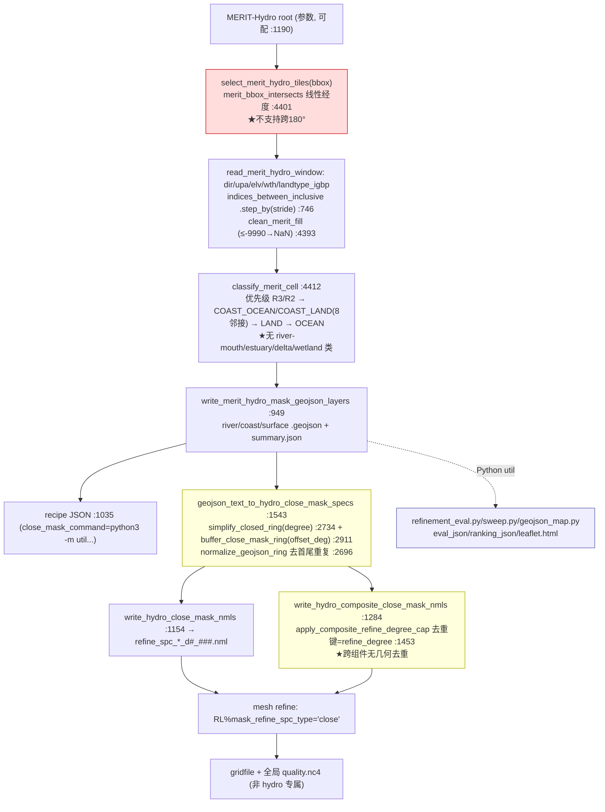
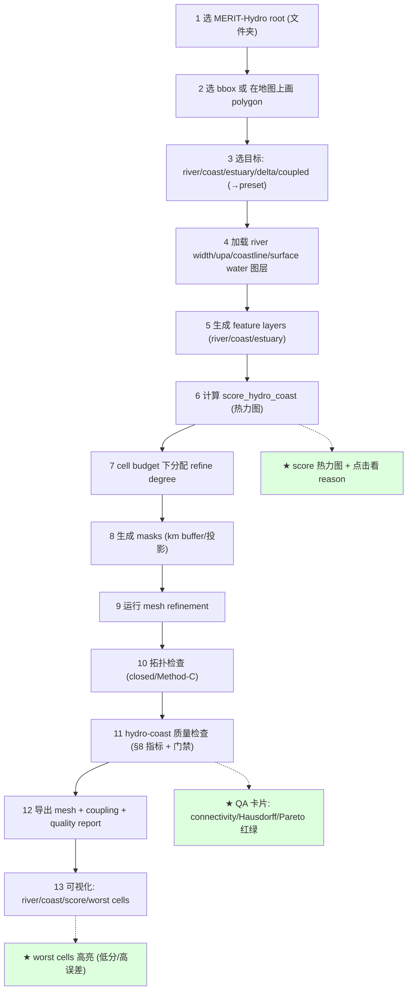

# 06 — MERIT-Hydro / Hydro-Coast Workflow Deep Audit (EarthMesh v3)

> Phase P4b（提案，可提 patch，不落地）· 未修改任何 `src/rust` 代码
> 基准：[AUDIT_PRINCIPLES.md](./AUDIT_PRINCIPLES.md) · 上游：[02_workflow_consistency_audit.md](./02_workflow_consistency_audit.md)（hydro/coast 概览）· [04](./04_physical_refinement_audit.md)（score 框架）· [05](./05_coupled_mesh_audit.md)（耦合）
> 审查对象：EarthMesh v3，分支 `v3.0.0-alpha1`，仅当前项目，不引用任何旧版本。
> 证据：`cli/lib.rs` 行号（merit/hydro_close/classify/composite/simplify/buffer）+ grep 全量核查。
> 日期：2026-06-22 · 证据等级见 AUDIT_PRINCIPLES §5。

---

## 0. 核心结论（先读）

hydro-coast workflow 的**数据读取与分类基本自洽**（nodata 处理、单位明确、root 可配、river>coast 优先级清晰），但**几何与坐标处理几乎全部基于 degree**——buffer、simplify、距离、tile-bbox 相交均无 cos(lat) 修正或等面积投影，导致**高纬度失真、窄河道破坏、跨 180° 不支持**；同时**river-mouth/estuary/delta/wetland 无独立类别**、**composite 跨组件无几何去重**、**Rust 侧无 hydro-coast eval/ranking**（在 Python `util/`）。

20 项检查速览（✅ 自洽 / 🟡 部分 / ❌ 缺失或有 bug）：

| # | 检查 | 结论 | # | 检查 | 结论 |
|---|------|------|---|------|------|
| 1 | root 可配置 | ✅ `:1190` | 11 | river-mouth 显式识别 | ❌ 0 命中 |
| 2 | tile 覆盖 bbox 边缘 | 🟡 需二次过滤 `:1212` | 12 | estuary/delta/wetland 类别 | ❌ 仅 CaMa `is_estuary` 标记 `:4583` |
| 3 | 跨 180° | ❌ `merit_bbox_intersects:4401` | 13 | close 自交检查 | 🟡 area-judge 有,buffer 路径未必 `:25103` |
| 4 | 高纬失真 | ❌ 纯 degree `:2734` | 14 | close 去重复点 | ✅ `normalize_geojson_ring:2696` |
| 5 | nodata | ✅ `clean_merit_fill:4393` | 15 | simplify 破坏窄河道 | 🟡 Douglas-Peucker degree `:2734` |
| 6 | stride 漏窄河道 | ❌ `.step_by(stride):746` | 16 | buffer=degree | ❌ `buffer_deg:503` |
| 7 | river width 单位 | ✅ `r*_width_m:450` | 17 | meter/等面积 buffer | ❌ 无 |
| 8 | upstream area 单位 | ✅ `r*_upa_km2:441` | 18 | composite 重复细化 | 🟡 去重键仅 degree `:1453` |
| 9 | river/coast priority | ✅ `classify_merit_cell:4412` | 19 | degree 间连续 transition | 🟡 仅 cumulative `:1609` |
| 10 | river∩coast overlap | ✅ river 优先 `:4412` | 20 | eval/ranking 证明更优 | ❌ Rust 无,在 Python util |

---

## 1. Current Workflow Map



---

## 2. Bug Risk Table

| ID | 风险 | 位置 | 严重度 | 说明 | 修复方向 |
|----|------|------|--------|------|----------|
| H-B1 | 跨 180° bbox 不支持 | `merit_bbox_intersects :4401` | High | 经度线性比较 `a.west<b.east && a.east>b.west`，跨日期线 bbox 会选错/漏 tile（太平洋、白令海、东西伯利亚） | 复用已有 `shift_longitudes_for_dateline_crossing`（`:14`）或拆成两段 bbox |
| H-B2 | composite 跨组件同区域重复细化 | `apply_composite_refine_degree_cap :1453-1489` | Med | cap 仅按 `refine_degree` 计数，去重键不含几何/坐标 → 两组件覆盖同一河段在同 degree 各生成一个 mask | 几何并集去重（按多边形重叠）后再 cap |
| H-B3 | buffer 偏移可能引入自交，未在 hydro 路径检查 | `buffer_close_mask_ring_for_refine_degree :2911`；自交检查在 area-judge `:25103` | Med | 凹多边形向外/内 offset 易自交；自交检查只在 area-judge close 曲线，hydro buffer 后的 ring 未必经过该检查 | buffer 后做自交检测+修复（或用稳健 offset 库） |
| H-B4 | tile 选中但与精确 bbox 不重叠 | 注释 `:1212` | Low | 已知需二次过滤；若下游忘了过滤会读多余 tile | 在 reader 内强制窗口裁剪 |
| H-B5 | stride 后窄河道像素被跳过 | `indices_between_inclusive .step_by(stride) :746` | Med | 见 H-P/H-D，既是数据也是 bug 面：抽样而非聚合，窄于 stride 的河道直接消失 | 用 max-pooling/河道保持聚合替代纯抽样 |

---

## 3. Physical Risk Table

| ID | 风险 | 位置 | 违背原则 | 说明 | 修复方向 |
|----|------|------|----------|------|----------|
| H-P1 | 无 river-mouth 显式类别 | grep `mouth/outlet`=0 | 2 | 河口是陆海耦合关键过渡带，当前归入 river 或 coast，物理过程（径流入海）不可辨识 | 新增 RiverMouth 类（接 CaMa）见 [05](./05_coupled_mesh_audit.md)§3 |
| H-P2 | 无 estuary/delta/wetland 类别 | `is_estuary` 仅标记 `:4583` | 2 | CaMa `is_estuary` 已有但未进分类/score；三角洲/湿地无法表达 | 接入 CaMa + 新类别 |
| H-P3 | river>coast 优先级掩盖河口 | `classify_merit_cell :4412` | 2 | 河口像素同时满足 R2/R3 与 COAST_*，被优先判为 river，丢失海岸属性 | 河口单独判定优先于二者 |
| H-P4 | 无证据证明细化后 mesh 更优 | Rust 无 eval/ranking（在 Python util `:1070`） | 3 | 无法量化"细化收益>成本"；ranking 在 Python，Rust-native 不可复现 | Rust 化 eval/ranking（§8） |
| H-P5 | degree 间过渡仅靠 cumulative | `cumulative_refine :1609` | 4 | 生成 1..N 全层 mask 以求过渡，但无基于距离的连续 transition 保证 | 距离驱动的渐变 refine（§7） |
| H-P6 | 分类阈值物理依据未对照过程 | `MeritMaskThresholds :449` | 1,2 | R2/R3 用固定 width/upa 阈值，未说明对应何种水文过程/目标模式 | 阈值随 preset + physical_process 声明（[04](./04_physical_refinement_audit.md)） |

---

## 4. Geometry Risk Table

| ID | 风险 | 位置 | 严重度 | 说明 | 修复方向 |
|----|------|------|--------|------|----------|
| H-G1 | 高纬度纯 degree 失真 | `simplify_closed_ring/point_line_distance_deg :2734-3079` | High | 60°N 处 1° 经距≈0.5×赤道；buffer/simplify/距离用 degree → 同一参数在高纬实际地面尺度不一致 | 局地等面积/等距投影（见 H-G2） |
| H-G2 | buffer 以 degree 计，非 meter/km | `buffer_deg_by_refine_degree :503` | High | 物理上"距河 X km 细化"才有意义；degree buffer 在经向/纬向各向异性且随纬度变 | 改 meter/km buffer，在局地方位等距/UTM/Lambert 下生成后投回经纬 |
| H-G3 | simplify(degree) 破坏窄河道 | `simplify_closed_ring :2734` | Med | Douglas-Peucker 在 (lon,lat) 欧氏空间，tolerance=degree；窄河弯易被抹平，且高纬更甚 | 拓扑保持简化 + 按 km tolerance + 河道宽度下限保护 |
| H-G4 | buffer 自交未必修复 | `:2911` + H-B3 | Med | 见 H-B3 | 同 H-B3 |
| H-G5 | close ring 去重仅首尾 | `normalize_geojson_ring :2696` | Low | 仅 pop 首尾重复，中间近重复点/零长边未清理 | 容差去重 + 退化边清理 |
| H-G6 | 面积/距离无球面度量 | grep haversine/geodesic=0（hydro 路径） | Med | tile/bbox/buffer 均平面 degree，无球面/地理距离 | 距离用 haversine/geodesic |

---

## 5. Data Risk Table

| ID | 风险 | 位置 | 严重度 | 说明 | 修复方向 |
|----|------|------|--------|------|----------|
| H-D1 | stride 抽样漏窄河道 | `.step_by(stride) :746` | Med-High | 抽样而非聚合；宽度<stride 像素的支流/窄道整段丢失 → 河网连通断裂 | 聚合（max upa / 河道命中保留）替代抽样 |
| H-D2 | nodata 处理（已做，注意传播） | `clean_merit_fill ≤-9990→NaN :4393`；classify `is_finite() :4412` | Low | NaN 被 classify 当作"非 river"；若整 tile 缺测会静默归为 land/ocean | 记录 nodata 占比，缺测超阈值告警 |
| H-D3 | ocean landtype 硬编码 IGBP 0/17 | `is_merit_ocean_landtype :4437`（见 [02](./02_workflow_consistency_audit.md)） | Med | 换数据集（非 IGBP 编码）即失效 | 编码表外置到 DataLayer |
| H-D4 | 单位虽明确但无运行期校验 | `r*_width_m :450`,`r*_upa_km2 :441` | Low | 若输入 NetCDF 单位不符（cm/m²）无检测 | 读入时校验 units 属性 |
| H-D5 | root 可配但无存在性/完整性预检 | `select_merit_hydro_tiles :864` | Low | 缺 tile 静默少选，无覆盖率报告 | 报告期望 vs 实得 tile 覆盖率 |

---

## 6. Proposed Hydro-Coast Score

按用户骨架补全归一化与数据（每 term = 一个 plugin `RefinementCriterion`，遵循 [04 §3.0](./04_physical_refinement_audit.md#30-通用归一化与合成规则)）：

```
score_hydro_coast =
   w1  · normalized_log_upstream_area        // norm(log10(upa_km2))，跨量级稳健
 + w2  · normalized_river_width              // norm(wth_m)
 + w3  · river_order_priority                // R3>R2>R1 → {1.0,0.6,0.3}
 + w4  · exp(-distance_to_river / Lr)        // Lr 以 km；近河道优先
 + w5  · exp(-distance_to_coast / Lc)        // Lc 以 km；近岸优先
 + w6  · river_mouth_priority                // CaMa river-mouth→1 [需接入]
 + w7  · estuary_priority                    // CaMa is_estuary→1 [需接入]
 + w8  · delta_wetland_priority              // 三角洲/湿地掩膜 [需数据]
 + w9  · drainage_connectivity_priority      // 河网连通中断处↑（dir 一致性）
 + w10 · basin_boundary_priority             // 流域边界（分水岭）priority
 + w11 · coastline_complexity                // 单元内岸线曲率/分形
 + w12 · unresolved_land_ocean_fraction_error// min(land,ocean)·2（混合带）见 [05](./05_coupled_mesh_audit.md)
 + w13 · coupling_error_indicator            // overlay 守恒残差风险 见 [05](./05_coupled_mesh_audit.md)
 + w14 · user_defined_priority               // 用户掩膜 0..1
```

> 距离项 `Lr/Lc` **以 km 定义**（不是 degree）→ 直接修复 H-G1/H-G2。`river_order_priority` 替代当前隐式 R2/R3 二档。预算与门禁见 [03 `RefinementBudget`](./03_config_schema_audit.md#3-rust-type-sketches)/[05 §6](./05_coupled_mesh_audit.md#6-coupling-quality-metrics)。

**Preset 权重（0–1）**：

| Preset | w1 upa | w2 wth | w3 order | w4 d-river | w5 d-coast | w6 mouth | w7 estuary | w8 delta | w9 connect | w10 basin | w11 coast | w12 frac | w13 coupl | w14 user |
|--------|:--:|:--:|:--:|:--:|:--:|:--:|:--:|:--:|:--:|:--:|:--:|:--:|:--:|:--:|
| River network | .9 | .8 | 1.0 | .9 | .1 | .4 | .3 | .3 | .8 | .5 | .1 | .2 | .2 | 0 |
| Coastal | .2 | .2 | .2 | .2 | 1.0 | .6 | .6 | .5 | .2 | .1 | .9 | .7 | .6 | 0 |
| Estuary/delta | .6 | .6 | .5 | .6 | .8 | 1.0 | 1.0 | .9 | .6 | .2 | .7 | .8 | .7 | 0 |
| Coupled (hydro+coast) | .7 | .6 | .6 | .7 | .8 | .8 | .7 | .6 | .7 | .3 | .8 | .9 | .9 | 0 |

---

## 7. Better Mask Generation Method

| 维度 | 当前 | 建议 |
|------|------|------|
| Buffer 单位 | degree（`:503`） | **km**，在**局地等距/等面积投影**（如 cell 中心的 azimuthal equidistant 或分带 UTM/Lambert）下做 offset，再投回经纬 → 修 H-G1/H-G2 |
| Simplify | Douglas-Peucker degree（`:2734`） | **km tolerance + 拓扑保持**（避免河道断裂）+ 河道宽度下限保护点 → 修 H-G3 |
| 跨 180° | 不支持（`:4401`） | tile 选择与 ring 生成统一走 `shift_longitudes_for_dateline_crossing`（`:14`）→ 修 H-B1 |
| stride | 抽样 `.step_by`（`:746`） | **聚合**（窗口内 max upa / 河道命中即保留）→ 修 H-D1 |
| composite 去重 | 仅按 degree 计数（`:1453`） | **几何并集去重**（同 degree 重叠多边形先 union 再 cap）→ 修 H-B2 |
| 自交 | hydro 路径未必检查 | buffer 后**自交检测+修复**（如 ear-clipping/robust offset）→ 修 H-B3 |
| transition | cumulative 全层（`:1609`） | **距离驱动渐变**：refine degree 随 distance_to_feature 平滑递减，满足 `max_refine_ratio` |
| 分类 | R2/R3/COAST 二档 | 多类（含 river-mouth/estuary/delta/wetland）+ score 连续值 |

---

## 8. Better Eval / Ranking Metrics（证明 mesh 更优）

当前 Rust 无 hydro-coast eval/ranking（在 Python `util/hydro_mesh/refinement_eval.py`/`refinement_sweep.py`，[02](./02_workflow_consistency_audit.md)§0）。建议 Rust-native 指标：

| 指标 | 定义 | 证明什么 |
|------|------|----------|
| river length captured | 网格解析的河道总长 / 真实河道长 | 河网保真 |
| river connectivity score | 连通河段数 / 总河段（dir 追踪） | 无断流（原则 4） |
| coastline Hausdorff | 网格岸线 vs 真实岸线最大偏差 | 岸线保真 |
| % river cells at target res | 达目标边长的河道单元占比 | 细化达标 |
| coast/river overlap cells | 命中河/岸的单元数（已在 manifest metrics） | 覆盖度 |
| benefit/cost (Pareto) | Σ score 提升 / Δcell 数 | 收益>成本（原则 3） |
| fraction error before/after | 陆海 fraction 误差变化 | 耦合改善（[05](./05_coupled_mesh_audit.md)） |
| transition smoothness | 相邻单元 refine ratio 分布 | 无突变 |
| ranking | 多 recipe 跑 sweep，按上述加权排序 | 选最优 recipe |

> 关键：ranking 必须用**同一份 Rust 指标**对比候选 recipe，并产出 before/after，避免 Python/Rust 双源漂移（[02](./02_workflow_consistency_audit.md) W4）。

---

## 9. GUI Workflow（13 步）



要点：当前 GUI **完全不暴露 MERIT-Hydro/hydro-close**（[02](./02_workflow_consistency_audit.md)§8，只能 CLI+Python）。以上 13 步为新增；步骤 2 的"画 polygon"修复 tile 选择仅 bbox（[02](./02_workflow_consistency_audit.md) #12）；步骤 6/11/13 的可视化满足原则 5。

---

## 10. Tests Needed

| 测试 | 目的 |
|------|------|
| `merit_bbox_crosses_antimeridian_selects_both_sides` | 跨 180° tile 选择正确（H-B1） |
| `merit_tile_selection_covers_bbox_edges` | bbox 边缘 tile 不漏（H-B4） |
| `merit_stride_preserves_narrow_river` | 窄河道在 stride 下不丢（H-D1） |
| `merit_nodata_propagates_and_reports` | nodata 占比报告（H-D2） |
| `classify_river_mouth_distinct_from_river_and_coast` | 河口独立类（H-P1/P3） |
| `classify_estuary_from_cama` | CaMa is_estuary→Estuary（H-P2） |
| `buffer_km_consistent_across_latitude` | 高纬/低纬 buffer 地面距离一致（H-G1/G2） |
| `simplify_preserves_narrow_channel` | 简化不断河（H-G3） |
| `buffer_self_intersection_repaired` | buffer 自交被修复（H-B3） |
| `composite_dedup_geometric_overlap` | 跨组件同区域不重复细化（H-B2） |
| `transition_refine_ratio_within_budget` | 过渡满足 max_refine_ratio（H-P5） |
| `hydro_coast_eval_ranking_orders_recipes` | eval/ranking 排序正确（H-P4） |

> 现状：现有测试覆盖 mask 生成/recipe/composite 的占位行为（`hydro_close_*`/`hydro_composite_close_mask_cli`，[01](./01_build_and_crate_audit.md)），但**上述几何/分类/eval 测试全缺**。

---

## 11. Patch Plan（提案，待 P8 批准）

| Patch ID | 关联 | 目标 | 改动摘要 | 验证 | 风险 |
|----------|------|------|----------|------|------|
| PATCH-H1 | H-B1 | 跨 180° tile 选择 | `merit_bbox_intersects` 接 `shift_longitudes_for_dateline_crossing` | antimeridian 测试 | 中 |
| PATCH-H2 | H-G1/G2/G3 | km/等面积 buffer + simplify | 局地投影下 offset/简化，degree→km | `buffer_km_consistent_*` | 高（几何核心） |
| PATCH-H3 | H-D1 | stride 聚合 | 抽样改窗口聚合（保河道） | `merit_stride_preserves_narrow_river` | 中 |
| PATCH-H4 | H-B2 | composite 几何去重 | 同 degree 重叠 union 再 cap | `composite_dedup_geometric_overlap` | 中 |
| PATCH-H5 | H-B3 | buffer 自交修复 | offset 后检测+修复 | `buffer_self_intersection_repaired` | 中 |
| PATCH-H6 | H-P1/P2/P3 | river-mouth/estuary/delta 类别 | 接 CaMa + classify 扩展 | 分类测试 | 中 |
| PATCH-H7 | H-P4 | Rust eval/ranking | §8 指标 + sweep 排序（替代 Python） | `hydro_coast_eval_ranking_*` | 高 |
| PATCH-H8 | H-P5 | 距离驱动 transition | refine degree 随距离渐变 | `transition_refine_ratio_*` | 中 |
| PATCH-H9 | §6 | score_hydro_coast + 4 preset | plugin criteria（接 [04](./04_physical_refinement_audit.md)） | score 单测 | 中 |
| PATCH-H10 | §9 | GUI hydro-coast 13 步 | 复用 walkers；画 polygon + 热力图 | GUI 内联测试 | 中（归 P6） |

> 顺序：H1（快速修 dateline）→ H2/H3（几何/数据正确性）→ H4/H5（mask 稳健）→ H6（类别）→ H7/H8/H9（score+eval+transition）→ H10（GUI）。先决：[03](./03_config_schema_audit.md) S1-S3。

---

## 关键证据索引（file:line，均 `cli/lib.rs`）

- tile/bbox：`select_merit_hydro_tiles:864`、`merit_bbox_intersects:4401`、`shift_longitudes_for_dateline_crossing` import `:14`、二次过滤注释 `:1212`
- read/window：`indices_between_inclusive .step_by(stride):746`、`clean_merit_fill:4393`、classify `is_finite():4412`
- 分类：`classify_merit_cell:4412`、`is_merit_ocean_landtype:4437`、`MeritMaskThresholds:449`（`r*_width_m:450`,`r*_upa_km2:441`）、CaMa `is_estuary:4583`
- 几何：`simplify_closed_ring:2734`、`simplify_ring_segment:3018`、`buffer_close_mask_ring_for_refine_degree:2911`、`normalize_geojson_ring:2696`、自交 `area_judge_first_self_intersection:25103`
- close/composite：`buffer_deg_by_refine_degree:503`、`geojson_text_to_hydro_close_mask_specs:1543`、`apply_composite_refine_degree_cap:1453`、`cumulative_refine:1609`、recipe python 命令 `:1070`
- eval/ranking：Rust 无；Python `util/hydro_mesh/refinement_eval.py`/`refinement_sweep.py`/`geojson_map.py`（[02](./02_workflow_consistency_audit.md)）

*本报告为 hydro-coast 深度审查 + 设计提案；现状结论基于实际源码与 grep 全量核查。未修改任何 `src/rust` 代码。*
