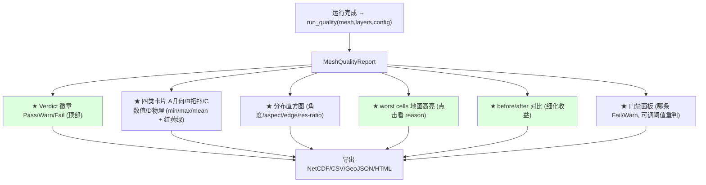

# 08 — Mesh Quality Metrics System Design (EarthMesh v3)

> Phase P5（提案，可提 patch，不落地）· 未修改任何 `src/rust` 代码
> 基准：[AUDIT_PRINCIPLES.md](./AUDIT_PRINCIPLES.md)（原则 4：几何/拓扑/数值/耦合质量达标）
> 关联：[03 `QualityConstraintConfig`](./03_config_schema_audit.md#3-rust-type-sketches) · [04 `CriterionQualityContribution`](./04_physical_refinement_audit.md) · [05 coupling metrics](./05_coupled_mesh_audit.md#6-coupling-quality-metrics) · [06 hydro eval](./06_merit_hydro_hydro_coast_audit.md#8-better-eval--ranking-metrics) · [07 `GeometryQualityFlag`](./07_geometry_gis_audit.md#7-geometryqualityflags-design)
> 审查对象：EarthMesh v3，`v3.0.0-alpha1`，仅当前项目，不引用旧版本。
> 证据：`cli/lib.rs:19253`(write_grid_quality)、`QualityClassMetrics`、mesh `TriangleMeshQualityFortranOutput`/`PolygonMeshQualityFortranOutput`、`:16049/16090/16128`(3 阶段 quality)。
> 日期：2026-06-22 · 证据等级见 AUDIT_PRINCIPLES §5。

---

## 0. 现状基线（先读）

v3 当前 quality **只覆盖几何角度/边长**（A 级实证）：

| 现有产物 | 内容 | 位置 |
|----------|------|------|
| `gridfile_quality.nc4` / `quality_before_spring.nc4` / `quality_after_spring.nc4` | 每类(三角 sjx / 五·六·七边形)的：**边长 cache、角度 cache、极值角(min/max)、平均 min/max 角、角度 std、角度 less/more 阈值计数** | `cli:16049,16090,16128`；`QualityClassMetrics`；mesh `TriangleMeshQualityFortranOutput` |
| `check-method-c-neighbors.sh` | 邻接一致性脚本（部分拓扑） | Makefile |

**结论**：当前 ≈ 覆盖 **3–4 / ~80** 项请求指标（仅几何角度类）。**连 cell 面积统计、aspect/skew/compactness、全部拓扑、全部数值稳定性、全部物理保真度、全部耦合质量都缺**，且**无 pass/warn/fail 门禁、无 GUI 展示、无 HTML、无 worst-cells**。本文档设计完整体系填补之。

---

## 1. Proposed `earthmesh_quality` Crate Design

```
earthmesh_quality (新 crate)
├── 依赖: earthmesh_core, earthmesh_mesh, earthmesh_geometry  (+ 可选 netcdf 经 cli)
├── 输入: UnstructuredMesh (gridfile) + 可选 DataLayers(landtype/MERIT/bathy...) + CoupledCellAttributes([05](./05_coupled_mesh_audit.md))
├── 计算: 4 大类 metric (A 几何 / B 拓扑 / C 数值 / D 物理保真)
│     每 metric = 一个 QualityMetric (trait, 复用 [04 plugin 思路](./04_physical_refinement_audit.md))
├── 评级: 对照 QualityConstraintConfig ([03](./03_config_schema_audit.md)) → Pass/Warn/Fail
├── 输出: NetCDF(逐 cell) + CSV(汇总) + GeoJSON(worst cells) + Markdown/HTML(报告)
└── 接口: run_quality(mesh, layers, config) -> MeshQualityReport
```

设计要点：
- **独立 crate**，不污染现有 mesh/cli；现有 `grid_quality_*` 作为 A 类的"角度/边长"子集被吸收/复用（[03 §9 零迁移](./03_config_schema_audit.md#9-migration-free-compatibility-strategyv3-内部无破坏)）。
- **plugin metric**：`trait QualityMetric { fn id; fn compute(ctx)->MetricResult; fn threshold()->QualityGate; fn applies_to(domain) }` → 新指标即插即用，自动进 report/GUI（与 [04 `RefinementCriterion`](./04_physical_refinement_audit.md#3-score-formulas) 对称）。
- **before/after** 支持：同一报告携带细化前/后两份，量化"细化收益"（原则 3）。
- **球面感知**：面积用球面/等面积（[07 G3](./07_geometry_gis_audit.md#9-patch-plan)），避免平面 degree² 失真。

---

## 2. `MeshQualityReport` Struct

```rust
pub struct MeshQualityReport {
    pub meta: QualityMeta,                  // mesh id, nxp, cell 数, tool/schema 版本, 时间(由调用方注入)
    pub geometry: GeometryQuality,          // A
    pub topology: TopologyQuality,          // B
    pub numerical: NumericalStability,      // C
    pub physical: PhysicalFidelity,         // D (land/ocean/hydro/coupling/atmos)
    pub flags: Vec<GeometryQualityFlag>,    // 复用 [07](./07_geometry_gis_audit.md)
    pub gates: Vec<GateResult>,             // 每条门禁的 Pass/Warn/Fail
    pub worst_cells: Vec<WorstCell>,        // 最差 N 单元(GeoJSON 用)
    pub verdict: QualityVerdict,            // Pass | Warn | Fail (聚合)
    pub before: Option<Box<MeshQualityReport>>, // 细化前(可选, 用于收益对比)
}
pub struct GateResult { pub metric_id: String, pub value: f64, pub gate: QualityGate, pub level: QualityLevel }
pub enum QualityLevel { Pass, Warn, Fail }
pub enum QualityVerdict { Pass, Warn, Fail }
pub struct WorstCell { pub cell_index: u64, pub lon: f64, pub lat: f64, pub metric_id: String, pub value: f64, pub level: QualityLevel }

pub struct Stat5 { pub min: f64, pub max: f64, pub mean: f64, pub std: f64, pub cv: f64 }  // CV=std/mean

pub struct GeometryQuality {              // A
    pub cell_area: Stat5,                  // ★ 现状缺(仅边长/角度)
    pub edge_length: Stat5,
    pub min_angle_deg: f64, pub max_angle_deg: f64,
    pub angle_dev_from_ideal: Stat5,       // |angle - ideal|, ideal=60(tri)/120(hex)
    pub aspect_ratio: Stat5,
    pub skewness: Stat5,
    pub compactness: Stat5,                // 4πA/P² 等周商
    pub centroid_circumcenter_dist: Stat5, // well-centered 度量
    pub center_inside_count: u64,          // 中心在单元内
    pub self_intersection_count: u64,
    pub nonconvex_count: u64,
    pub spherical_area_rel_error: Stat5,   // 球面 vs 平面面积偏差
    pub excessive_curvature_edge_count: u64,
    pub dateline_cells: u64, pub polar_cells: u64,
}
pub struct TopologyQuality {              // B
    pub invalid_vertex_index: u64, pub invalid_cell_index: u64,
    pub duplicate_edge: u64, pub dangling_edge: u64, pub orphan_cell: u64,
    pub neighbor_reciprocity_fail: u64,    // Method-C: a邻b 但 b不邻a
    pub edge_cell_incidence_fail: u64, pub vertex_cell_incidence_fail: u64,
    pub euler_characteristic: i64,         // V - E + F (期望 2, 球面)
    pub abnormal_edge_count_cells: u64,    // 多边形边数异常
    pub isolated_refined_cells: u64,
    pub transition_continuity_fail: u64,
    pub max_adjacent_resolution_ratio: f64,
    pub refinement_level_gradient_max: f64,
    pub mask_boundary_leak: u64, pub hole_gap_overlap: u64,
    pub coastline_discontinuity: u64, pub river_path_discontinuity: u64,
}
pub struct NumericalStability {          // C
    pub smallest_edge_km: f64,
    pub cfl_limiting_edge_km: f64,
    pub max_resolution_jump: f64,
    pub transition_width_cells: Stat5,
    pub local_refinement_smoothness: f64,
    pub smoothing_converged: bool, pub smoothing_iters: u32,
    pub min_angle_fail_count: u64, pub high_aspect_fail_count: u64,
}
pub struct PhysicalFidelity {            // D
    pub land: Option<LandFidelity>,
    pub ocean: Option<OceanFidelity>,
    pub hydrology: Option<HydroFidelity>,
    pub coupling: Option<CouplingFidelity>,   // 复用 [05 §6](./05_coupled_mesh_audit.md#6-coupling-quality-metrics)
    pub atmosphere: Option<AtmosFidelity>,
}
// LandFidelity{ landcover_purity, landcover_entropy, lai_var_retained, elev_var_retained,
//   slope_var_retained, soil_heterogeneity_retained, twi_retained, drainage_density_retained,
//   unresolved_heterogeneity_index }
// OceanFidelity{ coastline_preservation, bathy_gradient_preservation, shelf_break_coverage,
//   estuary_coverage, river_mouth_coverage, sea_fraction_accuracy, island_preservation, narrow_strait_preservation }
// HydroFidelity{ river_length_captured, river_width_captured, upstream_area_captured,
//   high_order_river_coverage, small_river_loss_count, river_mouth_cells, outlet_connectivity,
//   basin_boundary_preservation, drainage_network_continuity, distance_to_river_dist(Stat5), false_positive_refined_area }
// CouplingFidelity{ coast_overlap_cells, land_ocean_fraction_consistency, mass_conservation_residual,
//   orphan_land_cells, orphan_ocean_cells, river_outlet_matching, mixed_cell_classification,
//   estuary_delta_representation, remapping_balance }
// AtmosFidelity{ topo_gradient_coverage, orographic_precip_coverage, track_coverage,
//   urban_hotspot_coverage, land_sea_contrast_coverage, resolution_gradient_constraint, cfl_risk }
```

---

## 3. Metric Table

图例 现状：✅已有 · 🟡部分 · ❌缺。

### A. 几何质量
| Metric | 定义 | 单位 | 现状 |
|--------|------|------|------|
| cell area min/max/mean/std/CV | 单元面积统计 | m² | ❌ |
| edge length min/max/mean/std/CV | 边长统计 | km | 🟡 有 length cache |
| min/max angle | 极值内角 | ° | ✅ `extreme_angles` |
| angle deviation from ideal | \|θ-θ_ideal\| | ° | 🟡 有角度 std |
| aspect ratio | 最长/最短边 或 外接/内切半径 | – | ❌ |
| skewness | 偏离理想形状度 | – | ❌ |
| compactness / isoperimetric | 4πA/P² | – | ❌ |
| centroid-circumcenter dist | 质心到外心距 | km | ❌ |
| center inside cell | 中心是否在单元内 | bool | ❌ |
| self-intersection | 单元自交 | count | ❌ |
| convexity | 单元是否凸 | bool | ❌ |
| spherical area accuracy | 球面 vs 平面面积偏差 | % | ❌（[07](./07_geometry_gis_audit.md)） |
| excessive curvature edge | 边跨度过大（弦≪弧） | count | ❌ |
| dateline/pole warning | 跨180°/近极 | count | ❌（[07](./07_geometry_gis_audit.md)） |

### B. 拓扑质量
| Metric | 定义 | 现状 |
|--------|------|------|
| invalid vertex/cell index | 越界索引 | ❌ |
| duplicate edge | 重复边 | ❌ |
| dangling edge | 悬挂边 | ❌ |
| orphan cell | 孤立单元 | ❌ |
| neighbor reciprocity | a↔b 邻接对称 | 🟡 `check-method-c-neighbors.sh` |
| edge-cell / vertex-cell incidence | 关联一致 | ❌ |
| Euler characteristic | V-E+F=2 | ❌ |
| abnormal polygon edge count | 边数异常多边形 | 🟡 有 class 计数 |
| isolated refined cells | 孤立细化单元 | ❌ |
| transition continuity | 过渡带连续 | ❌ |
| max adjacent resolution ratio | 相邻分辨率比 | ❌ |
| refinement-level gradient | 细化级梯度 | ❌ |
| mask boundary leak | mask 边界泄漏 | ❌ |
| hole/gap/overlap | 洞/缝/重叠 | ❌ |
| coastline/river discontinuity | 岸线/河网断裂 | ❌ |

### C. 数值稳定性
| Metric | 定义 | 现状 |
|--------|------|------|
| smallest edge length | 最小边长 | 🟡 可从 length 推 |
| CFL-limiting edge | 限制时间步的最小边 | ❌ |
| maximum resolution jump | 最大分辨率跳变 | ❌ |
| transition width | 过渡带宽(单元数) | ❌ |
| local refinement smoothness | 局部细化平滑度 | ❌ |
| smoothing convergence | spring 是否收敛 | 🟡 有 niter 但无收敛判定 |
| minimum angle fail count | 最小角不达标数 | ✅ `angle_less_flags` |
| high aspect ratio fail count | 高长宽比数 | ❌ |

### D. 物理特征保真度（全部 ❌，现状无任何物理保真指标）
| 域 | Metrics |
|----|---------|
| Land | landcover purity/entropy、LAI/elev/slope/soil/TWI/drainage variance retained、unresolved heterogeneity index |
| Ocean | coastline preservation、bathy gradient preservation、shelf break/estuary/river-mouth coverage、sea fraction accuracy、island/narrow-strait preservation |
| Hydrology | river length/width/upstream-area captured、high-order coverage、small-river loss、river-mouth cells、outlet connectivity、basin boundary、drainage continuity、distance-to-river dist、false-positive refined area |
| Coupling | coast overlap cells、fraction consistency、mass conservation、orphan land/ocean、outlet matching、mixed classification、estuary/delta repr、remapping balance（复用 [05 §6](./05_coupled_mesh_audit.md#6-coupling-quality-metrics)） |
| Atmosphere | topo-gradient/orographic/track/urban/land-sea coverage、resolution gradient constraint、CFL risk |

---

## 4. Pass / Warn / Fail Thresholds

默认门禁（可被 [03 `QualityConstraintConfig`](./03_config_schema_audit.md#3-rust-type-sketches) 覆盖；tri 与 hex 阈值不同）：

| Metric | Pass | Warn | Fail |
|--------|------|------|------|
| min angle (tri) | ≥30° | 20–30° | <20° |
| min angle (hex) | ≥100° | 90–100° | <90° |
| aspect ratio | <2 | 2–4 | >4 |
| skewness | <0.25 | 0.25–0.5 | >0.5 |
| compactness | >0.7 | 0.5–0.7 | <0.5 |
| center inside cell | 100% | ≥99% | <99% |
| self-intersection | 0 | – | ≥1 |
| neighbor reciprocity fail | 0 | – | ≥1 |
| orphan cell | 0 | – | ≥1 |
| Euler characteristic | =2 | – | ≠2 |
| max adjacent resolution ratio | ≤2 | 2–3 | >3 |
| CFL-limiting edge | ≥L_CFL | 0.8–1.0·L_CFL | <0.8·L_CFL |
| transition width | ≥3 cells | 2 | <2 |
| mass conservation residual | <1e-9 | 1e-9–1e-6 | ≥1e-6 |
| land/ocean fraction consistency | err<0.5% | 0.5–1% | >1% |
| coastline preservation (Hausdorff) | <0.5·cell | 0.5–1·cell | >1·cell |
| river outlet matching | 100% | ≥95% | <95% |
| small river loss | 0 | ≤5% | >5% |

聚合 verdict：任一 **Fail → Fail**；无 Fail 但有 Warn → Warn；全 Pass → Pass。`ViolationPolicy::Block` 时 Fail 阻断运行（原则 4）。

---

## 5. NetCDF Output Design（逐 cell + 全局）

```
earthmesh_quality_NXP####.nc4
dimensions: cell, edge, worst
global attrs: kind="earthmesh_mesh_quality", schema_version, nxp, verdict, n_fail, n_warn
# 逐 cell 变量 (f64/i8)
  cell_lon, cell_lat, cell_area_m2, cell_edge_min_km, cell_min_angle_deg, cell_aspect_ratio,
  cell_skewness, cell_compactness, cell_center_inside(i8), cell_self_intersect(i8),
  cell_refine_level(i8), cell_adjacent_res_ratio, cell_quality_level(i8: 0=Pass,1=Warn,2=Fail),
  cell_coupled_class(i8), cell_land_fraction, cell_ocean_fraction, cell_fraction_sum_error
# 全局标量 (每 metric 的 min/max/mean/std/cv + gate level)
  geom_*, topo_*, num_*, phys_land_*, phys_ocean_*, phys_hydro_*, phys_coupling_*, phys_atmos_*
```
> 复用现有 NetCDF writer 风格（[02](./02_workflow_consistency_audit.md)）；before/after 可写两个 group 或两个文件。

---

## 6. CSV Summary Design（一行一 metric，易 diff/CI）

```csv
category,metric_id,value,unit,gate_pass,gate_warn,gate_fail,level
geometry,min_angle_deg,18.4,deg,30,20,20,Fail
geometry,aspect_ratio_max,5.1,ratio,2,4,4,Fail
numerical,cfl_limiting_edge_km,2.3,km,3.0,2.4,2.4,Warn
coupling,mass_conservation_residual,3.0e-7,1,1e-9,1e-6,1e-6,Warn
hydrology,river_length_captured,0.92,frac,0.95,0.85,0.85,Warn
...
```
> 另出一行 `summary,verdict,Fail` + `summary,n_fail,2`。CI 可直接断言 verdict=Pass。

---

## 7. GeoJSON Worst Cells Design（可视化定位最差单元）

```json
{ "type": "FeatureCollection",
  "kind": "earthmesh_quality_worst_cells",
  "features": [
    { "type": "Feature",
      "geometry": { "type": "Polygon", "coordinates": [[...cell ring...]] },
      "properties": {
        "cell_index": 12345, "level": "Fail",
        "metric_id": "min_angle_deg", "value": 18.4,
        "secondary": { "aspect_ratio": 5.1, "refine_level": 3 },
        "reason": "min angle 18.4° < 20° (tri)" } }
  ] }
```
> 取每类 metric 的 top-N 最差 + 所有 Fail 单元；GUI 直接叠加高亮（§9）。按类别分层（geom/topo/hydro/coupling）便于筛选。

---

## 8. Markdown / HTML Report Design

**结构**（Rust-native 生成，替代 [02](./02_workflow_consistency_audit.md) 中 Python leaflet 的角色）：
1. **Header**：mesh id / nxp / cell 数 / verdict 徽章(绿/黄/红)。
2. **Verdict 摘要**：n_pass / n_warn / n_fail + Top 失败项。
3. **四类表**（A/B/C/D）：metric · value · gate · level（颜色）。
4. **before/after 对比**：细化收益（方差下降%、cell 增量、Pareto）。
5. **直方图**：角度/aspect/edge-length/resolution-ratio 分布（SVG 内联）。
6. **地图**：worst cells GeoJSON 叠加底图（HTML 用 leaflet/maplibre；MD 用静态图链接）。
7. **附录**：门禁配置快照 + 输入数据指纹（接 [03 `ReproducibilityManifest`](./03_config_schema_audit.md#3-rust-type-sketches)）。

> HTML 自包含（内联 SVG/JSON），无外部 Python 依赖 → 修复 [02](./02_workflow_consistency_audit.md) W3/W4 的 Rust/Python 割裂。

---

## 9. GUI Dashboard Design



要点（补 [02](./02_workflow_consistency_audit.md)§10、满足原则 4/5）：
- 当前 GUI **仅显示 cell/vertex 计数**（`gui/main.rs:2969`），**无任何质量指标**——dashboard 全为新增。
- worst-cells 地图叠加复用现有 walkers `MeshOverlay`（[02](./02_workflow_consistency_audit.md)），按 level 着色。
- before/after 让用户看到"细化是否真的更好"（原则 5 + 原则 3）。

---

## 10. Tests

| 测试 | 目的 |
|------|------|
| `quality_geometry_stats_on_known_mesh` | 已知网格的 area/edge/angle 统计正确 |
| `quality_aspect_skew_compactness_formulas` | aspect/skew/compactness 公式 vs 解析值 |
| `quality_min_angle_gate_pass_warn_fail` | 角度门禁分级正确 |
| `quality_topology_orphan_dangling_detected` | 孤立/悬挂检测 |
| `quality_neighbor_reciprocity_matches_method_c` | 与现有 method-c 脚本一致 |
| `quality_euler_characteristic_sphere_is_two` | 闭合球面 V-E+F=2 |
| `quality_cfl_smallest_edge_reported` | 最小边/CFL 边正确 |
| `quality_transition_continuity_flags_jump` | 分辨率突变被标记 |
| `quality_physical_variance_retained_land` | 方差保真计算（land） |
| `quality_coupling_mass_conservation_gate` | 守恒残差门禁（接 [05](./05_coupled_mesh_audit.md)） |
| `quality_hydro_river_length_captured` | 河长捕获率 |
| `quality_report_netcdf_csv_geojson_roundtrip` | 三种输出读写一致 |
| `quality_verdict_aggregation` | Fail>Warn>Pass 聚合正确 |
| `quality_before_after_benefit` | 细化前后收益计算 |

> 现状：质量相关测试仅覆盖现有角度/边长写出（`grid_quality_global_adapter` 等，[01](./01_build_and_crate_audit.md)）；上述拓扑/数值/物理/耦合质量测试全缺。

---

## 11. Patch Plan（提案，待 P8 批准）

| Patch ID | 关联 | 目标 | 改动摘要 | 验证 | 风险 |
|----------|------|------|----------|------|------|
| PATCH-Q1 | §1/§2 | 新 crate `earthmesh_quality` + `MeshQualityReport` 骨架 | struct + trait + run_quality | 编译+骨架测试 | 低（新增） |
| PATCH-Q2 | A | 几何 metrics（吸收现有角度/边长 + 补 area/aspect/skew/compactness/well-centered） | 球面面积（接 [07 G3](./07_geometry_gis_audit.md)） | 几何公式测试 | 中 |
| PATCH-Q3 | B | 拓扑 metrics（orphan/dangling/reciprocity/Euler/incidence/transition） | 图分析；复用 method-c | 拓扑测试 | 中 |
| PATCH-Q4 | C | 数值稳定性（CFL/res-jump/transition width/smoothness） | 边长+级别分析 | 数值测试 | 低 |
| PATCH-Q5 | D | 物理保真（land/ocean/hydro/coupling/atmos，variance-retained/coverage） | 接 DataLayers + [05](./05_coupled_mesh_audit.md)/[06](./06_merit_hydro_hydro_coast_audit.md) | 保真测试 | 高（需数据） |
| PATCH-Q6 | §4 | 门禁评级 + verdict（接 `QualityConstraintConfig`） | Pass/Warn/Fail + Block | 门禁测试 | 低 |
| PATCH-Q7 | §5/§6/§7 | NetCDF/CSV/GeoJSON 输出 | 复用 writer 风格 | roundtrip 测试 | 低 |
| PATCH-Q8 | §8 | Markdown/HTML 报告（Rust-native） | 自包含 SVG/JSON | 渲染测试 | 中 |
| PATCH-Q9 | §9 | GUI dashboard | 卡片+直方图+worst cells 地图+before/after | GUI 内联测试 | 中（归 P6） |

> 顺序：Q1（骨架）→ Q2/Q3/Q4（几何/拓扑/数值，无需外部数据）→ Q6（门禁）→ Q7（输出）→ Q5（物理保真，需数据）→ Q8/Q9（报告/GUI）。先决：[03](./03_config_schema_audit.md) S1（project crate 承载 `QualityConstraintConfig`）、[07 G1/G3](./07_geometry_gis_audit.md)（flags + 球面面积）。

---

## 关键证据索引（file:line）

- 现有 quality：`cli/lib.rs:19253`(write_grid_quality_global_netcdf)、`:16049/16090/16128`(3 阶段)、`QualityClassMetrics`(length/angle/extr/eavg/less/more)、mesh `TriangleMeshQualityFortranOutput`/`PolygonMeshQualityFortranOutput`(角度 min/max/avg/std + less/more flags)
- 现有拓扑检查：`check-method-c-neighbors.sh`（Makefile）
- GUI 无质量展示：`gui/main.rs:2969`（仅 cell/vertex 计数，[02](./02_workflow_consistency_audit.md)§10）
- 设计落点：[03 `QualityConstraintConfig`](./03_config_schema_audit.md#3-rust-type-sketches)、[05 coupling metrics](./05_coupled_mesh_audit.md#6-coupling-quality-metrics)、[06 hydro eval](./06_merit_hydro_hydro_coast_audit.md#8-better-eval--ranking-metrics)、[07 `GeometryQualityFlag`](./07_geometry_gis_audit.md#7-geometryqualityflags-design)

*本报告为质量度量体系设计提案；现状结论基于实际源码字段。未修改任何 `src/rust` 代码。*
