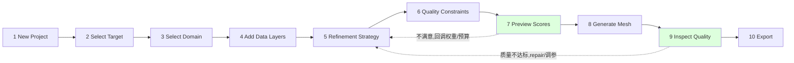
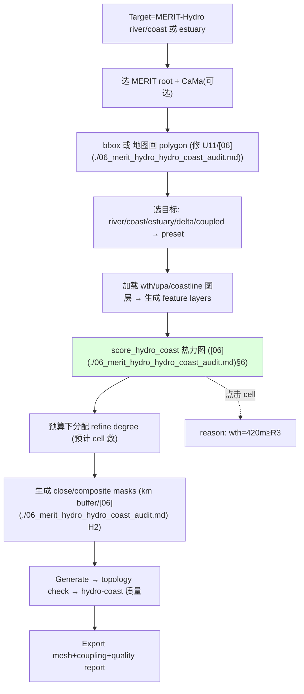
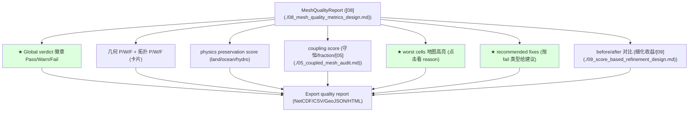

# 10 — GUI Redesign Proposal: From Parameter Form to Mesh-Making Workflow Platform (EarthMesh v3)

> Phase P6（提案，可提 patch，不落地）· 未修改任何 `src/rust` 代码
> 基准：[AUDIT_PRINCIPLES.md](./AUDIT_PRINCIPLES.md)（原则 5：GUI 让用户理解为何细化 + 细化后是否更好）
> 整合：[02 GUI 走查](./02_workflow_consistency_audit.md) · [03 三档配置/ProjectConfig](./03_config_schema_audit.md) · [04 presets/score](./04_physical_refinement_audit.md) · [05](./05_coupled_mesh_audit.md)/[06](./06_merit_hydro_hydro_coast_audit.md) hydro-coast · [08 quality dashboard](./08_mesh_quality_metrics_design.md) · [09 score preview/budget](./09_score_based_refinement_design.md)
> 证据：`gui/src/main.rs`（3 tabs Basics/Refinement/Advanced、`EarthMeshApp`、`start_run`/`poll_run`、walkers 地图、`:2969` 仅 cell/vertex 计数）、`gui/src/i18n.rs`（`(key,en,zh)` 双语表）。
> 日期：2026-06-22 · 证据等级见 AUDIT_PRINCIPLES §5。

---

## 0. 核心结论（先读）

当前 GUI 是一张**引擎参数表单**：3 个 tab（Basics/Refinement/Advanced）直接暴露 ~64 个 namelist 字段（含 HALO/transition/spring/num_rc），无"项目/目标"概念、无数据图层管理、无 score 预览、无质量反馈、无 MERIT-Hydro/hydro-coast 入口、native OLAM 靠粘贴文本（[02](./02_workflow_consistency_audit.md)/[03](./03_config_schema_audit.md)）。**优点**：cancel/progress 真实、walkers 地图预览、双语 i18n、preview 与生产已分离（[07](./07_geometry_gis_audit.md)）。

本提案把 GUI 升级为**工作流平台**：10 步向导 + 目标模板 + 数据图层管理器 + score 预览热力图 + 质量仪表盘 + Normal/Expert 双模式 + project save/load，全部沿用现有 `(key,en,zh)` i18n 约定。承载层是 [03 `ProjectConfig`](./03_config_schema_audit.md)，引擎复用现有 `start_run`，**零迁移**。

---

## 1. Current GUI Risks

| # | 风险 | 证据 | 违背原则 |
|---|------|------|----------|
| U1 | 参数表单心智：3 tab 暴露 ~64 engine 字段 | `gui/main.rs:3142-3861`（[02](./02_workflow_consistency_audit.md)/[03](./03_config_schema_audit.md) C7） | 5 |
| U2 | 用户被迫懂 NXP/HALO/transition/spring/num_rc | Advanced tab `:3711-3861` | 5 |
| U3 | 无"项目"概念：save 只存 namelist，无 project save/load | `combined_namelist :1457`（[03](./03_config_schema_audit.md) C8） | 5 |
| U4 | 无数据图层管理：仅 1 个 landtype 文本框 | `:3278-3293` | 1 |
| U5 | 无 score 预览：看不到"哪里会被细化、为什么" | 无 score（[09](./09_score_based_refinement_design.md)） | 1,2,5 |
| U6 | 无质量反馈：结果只显示 cell/vertex 计数 | `:2969-2983`（[08](./08_mesh_quality_metrics_design.md)） | 4,5 |
| U7 | MERIT-Hydro/hydro-close/composite 不可在 GUI 触发 | 仅 CLI+Python（[02](./02_workflow_consistency_audit.md)§8/[06](./06_merit_hydro_hydro_coast_audit.md)） | — |
| U8 | 无预算反馈：不知细化会产生多少 cell/成本 | 无 budget（[09](./09_score_based_refinement_design.md)） | 3 |
| U9 | native OLAM 嵌套靠粘贴原始文本 | `:3814` | — |
| U10 | regional FVCOM 开边界静默跳过，无提示 | `:1303-1305`（[02](./02_workflow_consistency_audit.md)） | — |
| U11 | 区域只能数值输入，不能地图上画 polygon | `:3231-3258`（[06](./06_merit_hydro_hydro_coast_audit.md) #12） | — |

**已有优点（保留）**：cancel/progress 真实（`:1969-2137`）、walkers 地图+MeshOverlay（`:698-996`）、双语 i18n、preview/production 分离（[07](./07_geometry_gis_audit.md)§6）。

---

## 2. New GUI Information Architecture

```
EarthMesh Studio
├── 顶栏: Project(New/Open/Save/SaveAs) · Mode(Normal/Expert) · Lang(中/EN) · Run/Cancel
├── 左栏: Workflow Stepper (10 步, §3) — 当前步高亮, 完成步打勾
├── 中栏: 当前步的工作区 (向导内容)
├── 右栏: Live 面板 (地图预览 + score 热力图 + 进度/日志)
└── 底栏: 状态 (verdict 徽章 · cell 数/预算 · 校验提示)
```

原则：**渐进式披露**——Normal 模式只显示意图层（目标/域/数据/质量目标），engine 旋钮全部折叠进 Expert（[03 §6](./03_config_schema_audit.md#6-gui-mapping)）。承载数据 = [03 `ProjectConfig`](./03_config_schema_audit.md)；每步读写 ProjectConfig 的一个子结构。

---

## 3. Workflow Wizard（10 步）



| 步 | 内容 | 写入 ProjectConfig | 关键反馈 |
|----|------|--------------------|----------|
| 1 New Project | 命名/作者/模板 | `metadata` | — |
| 2 Select Target | 12 模板之一（§7） | `targets[]` | preset 说明 |
| 3 Select Domain | global/regional(bbox/circle/**画polygon**) | `domain` | 地图框选 |
| 4 Add Data Layers | 17 图层管理（§8） | `data_layers[]` | 覆盖/缺失校验 |
| 5 Refinement Strategy | 策略+criteria+预算（§见 Strategy Panel） | `refinement` | 预计 cell 数 |
| 6 Quality Constraints | 门禁阈值（§10/[08](./08_mesh_quality_metrics_design.md)） | `quality` | — |
| 7 **Preview Scores** | composite score 热力图（[09](./09_score_based_refinement_design.md)） | — | **为何细化(原则5)** |
| 8 Generate Mesh | 调现有 `start_run` | → engine | 进度/cancel |
| 9 **Inspect Quality** | 质量仪表盘（§10） | — | **是否更好(原则4)** |
| 10 Export | 格式+报告+package | `output` | manifest |

---

## 4. Tab Structure

向导步骤映射到 tab（Normal 默认隐藏 Expert tab）：

| Tab | Normal | Expert |
|-----|--------|--------|
| **Project** | New/Open/Save/SaveAs/最近 | + schema 版本/迁移 |
| **Target** | 12 模板 + 分辨率(km) + 输出格式 | + NXP/cell 类型直填 |
| **Domain** | global/regional + 地图画域 | + lambert 参数/经度归一化 |
| **Data** | 图层管理器（§8） | + stride/单位/nodata 策略 |
| **Strategy** | preset + criteria 滑杆 + 预算 | + 原始阈值/manual masks/plugin |
| **Quality** | 目标(精度优先/成本优先) | + 每门禁阈值/ViolationPolicy |
| **Preview** | score 热力图 + 预计 cell 数 | + 逐 criterion 分量图 |
| **Run/Results** | 进度/日志/cancel + 质量仪表盘 | + CLI 命令预览/生成文件/raw log |

> 现有 3 tab（Basics/Refinement/Advanced）→ 重构为以上 8 tab；旧 Advanced 内容并入 Expert 模式（不丢功能）。

---

## 5. Fields by Tab

| Tab | Normal 字段 | Expert 追加 |
|-----|-------------|-------------|
| Project | name, authors, description, template | schema_version |
| Target | target kind, intent preset, resolution_km, model_format | nxp, cell(hex/tri), niter |
| Domain | mode(global/regional), shape(bbox/circle/close/**draw**), sea_ratio | lambert params, dateline handling |
| Data | 每图层: 启用/路径/角色（§8） | stride, var name, units, nodata, IGBP 编码表 |
| Strategy | preset, 每 criterion(开关+权重滑杆+阈值), budget(max_cells/min_edge_km), allocation | raw `th_*`, HALO, max_transition_row, spring_*, num_rc, vertex_pretect_layers, manual masks, plugin criteria |
| Quality | 模式(strict/balanced/loose), on_violation | 每 metric min/max 门禁（[08](./08_mesh_quality_metrics_design.md)） |
| Preview | score colormap, top-N worst | per-criterion 分量, 数据指纹 |
| Results | verdict, cell数, 质量卡片, 文件列表, 地图 | CLI 命令, 生成文件树, raw logs |

---

## 6. Normal Mode vs Expert Mode

| 维度 | Normal | Expert |
|------|--------|--------|
| 心智 | "我要什么网格" | "引擎怎么做" |
| 暴露 | 意图层 L1（目标/域/数据/质量目标/预算） | + L2 engine 旋钮（[03](./03_config_schema_audit.md)） |
| engine 参数 | 全自动（lower 推导） | 可显式覆盖（nxp/halo/spring...） |
| criteria | preset + 滑杆 | + 原始阈值/plugin/manual mask |
| 报告 | 质量卡片 + 摘要 | + CLI 命令/生成文件/raw log |
| 目标用户 | 科研用户/新手 | 开发者/专家 |
| 切换 | 顶栏开关；切回 Normal 不丢 Expert 设置（保留为 overrides） | — |

> 关键：Normal 用户**永不**需要理解 NXP/HALO/transition/spring（修 U2/原则 5）；Expert 完整保留现有 64 字段能力（不退化）。

---

## 7. Presets（12 目标模板）

每个模板 = [03 `MeshTargetConfig.intent`](./03_config_schema_audit.md#23-11-种-mesh-意图--preset-映射) + 默认 criteria 权重（[04](./04_physical_refinement_audit.md)/[06](./06_merit_hydro_hydro_coast_audit.md)）+ 默认数据图层 + 默认质量门禁 + 输出格式。

| 模板 | 域/格式 | 默认 criteria（主） | 默认图层 |
|------|---------|---------------------|----------|
| Global atmosphere mesh | atmos / MPAS | topo grad, orographic | DEM, precip |
| Regional land mesh | land / native | landcover, slope, LAI | landcover, DEM, LAI |
| Regional ocean mesh | ocean / FVCOM | bathy grad, coastline | bathymetry, coastline |
| Land-ocean coupled mesh | coupled / CoLM | coastline, fraction error, river-mouth | landcover, bathy, MERIT |
| MERIT-Hydro river/coast mesh | coupled / CoLM | river(R2/R3), coastline | MERIT-Hydro, CaMa |
| Coastal estuary mesh | ocean/coupled / FVCOM | estuary, river-mouth, coastline | CaMa, coastline, bathy |
| Hydrology-focused land mesh | land / CoLM | TWI, river distance, drainage | MERIT-Hydro, DEM |
| Urban land mesh | land / CoLM | urban/impervious | urban, landcover |
| Mountain/orographic atmosphere | atmos / MPAS | topo grad, orographic precip | DEM, precip |
| CoLM land mesh | land / CoLM | landcover, soil, LAI | landcover, soil, LAI |
| MPAS atmosphere mesh | atmos / MPAS | topo grad, TC track | DEM, typhoon |
| FVCOM coastal ocean mesh | ocean / FVCOM | coastline, bathy grad, distance-to-coast | coastline, bathymetry |

> 选模板即填好 §5 大部分字段；用户只需指定域 + 数据路径，其余自动。

---

## 8. Data Layer Manager（17 图层）

统一列表：每行 = 启用 / 名称 / 路径(Browse) / 角色(供哪些 criterion) / 状态(存在·覆盖率·单位)。映射 [03 `DataLayerConfig`](./03_config_schema_audit.md#3-rust-type-sketches)。

| 图层 | 角色（criterion） | 关联 |
|------|-------------------|------|
| land cover | landcover entropy/purity | [04](./04_physical_refinement_audit.md) |
| DEM | elevation/slope/curvature/TWI/topo grad | [04](./04_physical_refinement_audit.md) |
| LAI | LAI variability | [04](./04_physical_refinement_audit.md) |
| soil | soil hetero/hydraulic/thermal | [04](./04_physical_refinement_audit.md) |
| river network | river density/distance | [06](./06_merit_hydro_hydro_coast_audit.md) |
| MERIT-Hydro | river/coast/upa/wth | [06](./06_merit_hydro_hydro_coast_audit.md) |
| CaMa-Flood | estuary/river-mouth/discharge | [05](./05_coupled_mesh_audit.md)/[06](./06_merit_hydro_hydro_coast_audit.md) |
| coastline | coastline complexity/distance | [05](./05_coupled_mesh_audit.md) |
| bathymetry | bathy depth/grad/shelf | [04](./04_physical_refinement_audit.md) |
| SST | SST gradient/front | [04](./04_physical_refinement_audit.md) |
| SSH | SSH gradient | [04](./04_physical_refinement_audit.md) |
| EKE | EKE | [04](./04_physical_refinement_audit.md) |
| precipitation | orographic/extreme precip | [04](./04_physical_refinement_audit.md) |
| typhoon tracks | TC density | [04](./04_physical_refinement_audit.md) |
| urban | urban/impervious | [04](./04_physical_refinement_audit.md) |
| cropland | cropland/irrigation | [04](./04_physical_refinement_audit.md) |
| snow/permafrost | snow/permafrost priority | [04](./04_physical_refinement_audit.md) |

功能：**覆盖率校验**（数据是否覆盖 domain）、**单位校验**（[06](./06_merit_hydro_hydro_coast_audit.md) H-D4）、**缺失提示**（criterion 引用的图层缺失→该 criterion 灰显并告警，不静默细化）、**数据指纹**（sha256→[03 ReproducibilityManifest](./03_config_schema_audit.md)）。

---

## 9. MERIT-Hydro / Hydro-Coast GUI Flow（修 U7）



> 当前这条流程只能 CLI+Python（[02](./02_workflow_consistency_audit.md)/[06](./06_merit_hydro_hydro_coast_audit.md)）；GUI 化后用户可视化选域、看 score、调预算、看质量——满足原则 5。

---

## 10. Quality Dashboard（修 U6）



| 区块 | 数据源 |
|------|--------|
| global score / verdict | `MeshQualityReport.verdict`（[08](./08_mesh_quality_metrics_design.md)） |
| geometry/topology P/W/F | `gates` 按类聚合 |
| physics preservation | `PhysicalFidelity`（[08](./08_mesh_quality_metrics_design.md) D） |
| coupling score | `CouplingFidelity`（[05](./05_coupled_mesh_audit.md)§6） |
| worst cells | `worst_cells` GeoJSON（[08](./08_mesh_quality_metrics_design.md)§7）叠 walkers |
| recommended fixes | 由 fail metric 映射建议（如 min-angle fail→"提高 transition/降级"） |
| export | [08](./08_mesh_quality_metrics_design.md) §5-§8 四格式 |

---

## 11. i18n Key Suggestions

沿用现有 `(key, en, zh)` 约定（`i18n.rs:15`），新增命名空间。示例（节选，实际需补全）：

```rust
// project
("project.new", "New Project", "新建项目"),
("project.open", "Open…", "打开…"),
("project.save", "Save", "保存"),
("project.save_as", "Save As…", "另存为…"),
("project.recent", "Recent Projects", "最近项目"),
// mode
("mode.normal", "Normal", "常规"),
("mode.expert", "Expert", "专家"),
// wizard steps
("wizard.1_new", "New Project", "新建项目"),
("wizard.2_target", "Select Target", "选择目标"),
("wizard.3_domain", "Select Domain", "选择区域"),
("wizard.4_data", "Add Data Layers", "添加数据图层"),
("wizard.5_strategy", "Refinement Strategy", "细化策略"),
("wizard.6_quality", "Quality Constraints", "质量约束"),
("wizard.7_preview", "Preview Scores", "预览评分"),
("wizard.8_generate", "Generate Mesh", "生成网格"),
("wizard.9_inspect", "Inspect Quality", "检查质量"),
("wizard.10_export", "Export", "导出"),
// target templates
("target.global_atmos", "Global atmosphere mesh", "全球大气网格"),
("target.regional_land", "Regional land mesh", "区域陆面网格"),
("target.coupled", "Land-ocean coupled mesh", "陆海耦合网格"),
("target.merit_hydro", "MERIT-Hydro river/coast mesh", "MERIT-Hydro 河流/海岸网格"),
("target.estuary", "Coastal estuary mesh", "河口海岸网格"),
// data layers
("layer.landcover", "Land cover", "地表覆盖"),
("layer.dem", "DEM (elevation)", "DEM 高程"),
("layer.merit", "MERIT-Hydro", "MERIT-Hydro"),
("layer.cama", "CaMa-Flood", "CaMa-Flood"),
("layer.coastline", "Coastline", "海岸线"),
("layer.bathymetry", "Bathymetry", "海底地形"),
("layer.role", "Used by", "用于"),
("layer.missing", "Data missing — criterion disabled", "数据缺失 — 该判据已禁用"),
("layer.coverage", "Coverage", "覆盖率"),
// strategy
("strategy.preset", "Strategy preset", "策略预设"),
("strategy.criterion", "Criterion", "判据"),
("strategy.weight", "Weight", "权重"),
("strategy.budget", "Cell budget", "单元预算"),
("strategy.max_cells", "Max cells", "最大单元数"),
("strategy.min_edge", "Min edge (km)", "最小边长(km)"),
("strategy.est_cells", "Estimated cells", "预计单元数"),
// preview
("preview.score_map", "Refinement score", "细化评分"),
("preview.why", "Why refined", "为何细化"),
("preview.worst", "Worst cells", "最差单元"),
// quality
("quality.verdict", "Quality verdict", "质量判定"),
("quality.pass", "Pass", "通过"),
("quality.warn", "Warn", "警告"),
("quality.fail", "Fail", "失败"),
("quality.geometry", "Geometry", "几何"),
("quality.topology", "Topology", "拓扑"),
("quality.physics", "Physics preservation", "物理保真"),
("quality.coupling", "Coupling", "耦合"),
("quality.fixes", "Recommended fixes", "修复建议"),
("quality.export", "Export quality report", "导出质量报告"),
// expert
("expert.raw_config", "Raw config editor", "原始配置编辑器"),
("expert.cli_preview", "CLI command preview", "CLI 命令预览"),
("expert.gen_files", "Generated files", "生成的文件"),
("expert.logs", "Logs", "日志"),
("expert.manual_mask", "Manual masks", "手动掩膜"),
("expert.plugin", "Plugin criteria", "插件判据"),
```

> 规则：所有用户可见字符串走 `tr(lang, key)`；未命中回退 key（暴露漏译）。新增键按 `wizard.*`/`target.*`/`layer.*`/`strategy.*`/`preview.*`/`quality.*`/`expert.*` 命名空间。

---

## 12. Implementation Roadmap

| 阶段 | 内容 | 先决 | 风险 |
|------|------|------|------|
| G-1 | ProjectConfig save/load + 顶栏 Project 菜单 | [03](./03_config_schema_audit.md) S1 | 低 |
| G-2 | Normal/Expert 开关 + 旧 3 tab 内容迁入 Expert（不丢功能） | G-1 | 中（重排，回归保功能） |
| G-3 | Workflow stepper（10 步）骨架 + 步间导航 | G-1 | 低 |
| G-4 | Target 模板（12）+ Domain 地图画 polygon | G-3, [03](./03_config_schema_audit.md) | 中 |
| G-5 | Data Layer Manager（17 图层 + 覆盖/单位/缺失校验） | [03 DataLayerConfig](./03_config_schema_audit.md) | 中 |
| G-6 | Strategy Panel（preset+criteria 滑杆+预算+预计 cell 数） | [09](./09_score_based_refinement_design.md) R1-R5 | 中 |
| G-7 | **Score Preview 热力图**（复用 walkers MeshOverlay） | [09](./09_score_based_refinement_design.md) | 中 |
| G-8 | **Quality Dashboard**（verdict/卡片/worst cells/fixes/导出） | [08](./08_mesh_quality_metrics_design.md) Q1-Q8 | 中 |
| G-9 | MERIT-Hydro/hydro-coast GUI flow | [06](./06_merit_hydro_hydro_coast_audit.md), G-5 | 中 |
| G-10 | Expert: CLI 预览/生成文件树/raw config/plugin | G-2 | 低 |

> 顺序：G-1/G-2（项目+模式，最先，保功能不丢）→ G-3/G-4（向导+目标）→ G-5（数据）→ G-6/G-7（策略+score 预览）→ G-8（质量仪表盘）→ G-9（hydro GUI）→ G-10（Expert 收尾）。每步保留旧能力为 Expert，可回归。

---

## 13. Tests

| 测试 | 目的 |
|------|------|
| `gui_project_save_load_roundtrip` | ProjectConfig 存取一致 |
| `gui_normal_expert_toggle_preserves_settings` | 切模式不丢设置 |
| `gui_wizard_step_navigation` | 10 步前进/回退/校验拦截 |
| `gui_target_template_fills_defaults` | 选模板填好默认（criteria/图层/质量） |
| `gui_domain_draw_polygon_to_config` | 地图画域→domain 正确 |
| `gui_data_layer_missing_disables_criterion` | 缺数据→criterion 灰显告警 |
| `gui_data_layer_coverage_check` | 覆盖率校验 |
| `gui_strategy_estimated_cells_matches_budget` | 预计 cell 数与预算一致 |
| `gui_score_preview_renders_heatmap` | score 热力图渲染（[09](./09_score_based_refinement_design.md)） |
| `gui_score_preview_cell_click_shows_reason` | 点击 cell 显示 reason |
| `gui_quality_dashboard_verdict_colors` | verdict 红黄绿正确 |
| `gui_quality_worst_cells_overlay` | worst cells 地图叠加 |
| `gui_recommended_fixes_map_from_fail` | fail→修复建议映射 |
| `gui_i18n_all_keys_have_en_zh` | 所有新键有 en/zh（无回退裸 key） |
| `gui_merit_hydro_flow_end_to_end` | hydro-coast GUI 流程 |
| `gui_legacy_namelist_imports_to_project` | 旧 .nml 导入为 project（兼容） |

> 现状：GUI 有 35 个内联 `#[test]`，0 个集成测试（[01](./01_build_and_crate_audit.md)）；上述工作流/向导/仪表盘测试全缺。

---

## 关键证据索引（file:line）

- 当前 GUI：3 tab `gui/main.rs:3142`(Basics)/`:3500`(Refinement)/`:3744`(Advanced)；engine 字段 `:3711-3861`；landtype 单框 `:3278-3293`；区域数值输入 `:3231-3258`；run/cancel/progress `:1969-2137`；地图 `:698-996`；仅计数 `:2969-2983`；native OLAM 文本 `:3814`；FVCOM regional skip `:1303-1305`
- i18n：`gui/i18n.rs:8`(Lang En/Zh)、`:15`(TABLE)、约定 `nav.*`/`mesh.*`/`grid.*`/`f.*`/`c.*`
- 设计落点：[03 ProjectConfig/三档](./03_config_schema_audit.md)、[04 presets/score](./04_physical_refinement_audit.md)、[06 hydro GUI](./06_merit_hydro_hydro_coast_audit.md)、[08 quality dashboard](./08_mesh_quality_metrics_design.md)、[09 score preview/budget](./09_score_based_refinement_design.md)

*本报告为 GUI 重设计提案；现状结论基于实际源码。未修改任何 `src/rust` 代码。*
